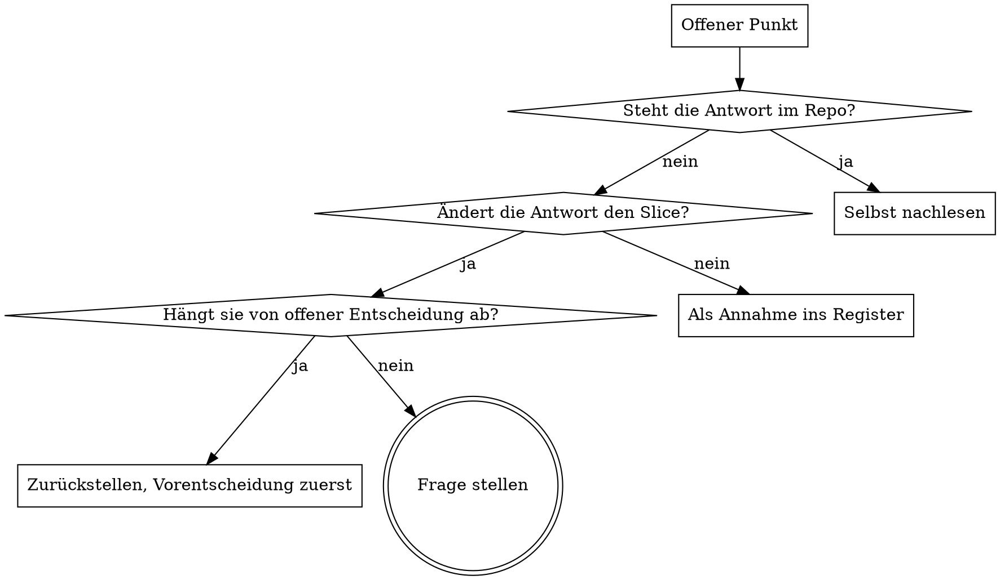

# Grill Me — Alignment durch sokratisches Nachbohren

## Überblick

Phase 2 des 8-Phasen-Workflows als ausführbares Verfahren. Ziel: Sebastian bleibt Architekt und Designer — ich rate nie, ich frage.

**Kernprinzip:** Jede Entscheidung, die ich still selbst treffe, ist eine Entscheidung, die Sebastian verloren hat. Lieber eine Frage zu viel als eine falsche Annahme im Code.

**Zweites Kernprinzip:** Viele Fragen dürfen nie viel Tipparbeit bedeuten. Jede Frage bringt fertige Optionen und meine Empfehlung mit. Antworten muss mit einem Buchstaben möglich sein.

## Eiserne Regel

**Kein Code, kein Plan, keine Datei-Änderung am Zielprojekt, bevor `alignment.md` steht und freigegeben ist.**

Keine Ausnahmen:
- Nicht „ich fange schon mal mit dem einfachen Teil an"
- Nicht „ich skizziere nur kurz"
- Nicht „das ist zu klein für ein Alignment"
- Nicht „ich frage den Rest beim Implementieren"

Habe ich vorher angefangen? Änderungen verwerfen, grillen, neu anfangen.

## Wann NICHT grillen

- Reine Wissensfragen („Was macht dieser Befehl?")
- Tippfehler, Formatierung, offensichtliche Bugfixes ohne Designentscheidung
- Der Slice hat bereits eine freigegebene `alignment.md` und der Umfang hat sich nicht geändert

## Ablauf

### Schritt 0 · Kontext holen (still, ohne Fragen)

Relevante `CLAUDE.md`, betroffene Dateien und letzte Commits lesen.

**Eine Frage, deren Antwort im Repo steht, ist eine verbotene Frage.** Erst suchen, dann fragen.

### Schritt 1 · Entscheidungsbaum + Annahmen-Register

Erst still den Entscheidungsbaum bauen: Was steht bereits fest? Was ist offen? Welche offene Entscheidung hängt von welcher ab?

Dann 8–15 nummerierte Annahmen vorlegen — kurze Aussagesätze, keine Fragen:

> 1. Das Tool läuft nur lokal, kein Server.
> 2. Nur du bedienst es.
> 3. Daten liegen als JSON im Projektordner.
>
> **Antworte nur mit den falschen Nummern**, z. B. „3 und 7 falsch" — oder „passt".

Der Baum bestimmt danach die **Fragenreihenfolge**: nie eine Detailfrage stellen, bevor die Entscheidung darüber gefallen ist. Sonst erledigen sich Antworten rückwirkend.

### Schritt 2 · Sokratische Einzelfragen

Eine Frage pro Nachricht. Format ist Pflicht:

> **Frage 4 von ca. 9** · Kategorie: *Fehlerfälle*
>
> Was passiert, wenn die SPS-Verbindung mitten im Schritt abreißt?
> **A)** Schrittkette einfrieren, Werte halten, Meldung
> **B)** Zurück auf Schritt 0, sauberer Neustart
> **C)** Letzter Wert wird weiterverwendet, keine Meldung
>
> **Mein Vorschlag: A** — B verliert den Anlagenzustand, C versteckt den Fehler.

Fragen kommen aus `fragenkatalog.md` — nur die, die für diesen Slice tatsächlich etwas ändern.

**Nach je ~4 Fragen eine Zwischen-Zusammenfassung:**
> *Stand: 4 entschieden · 1 offen · 2 Annahmen unbestätigt · noch ca. 5 Fragen*

### Schritt 3 · Devil's Advocate

Drei Angriffe auf das eigene Ergebnis, jeder mit konkretem Szenario:
1. *„Das scheitert, wenn …"*
2. *„Das wirst du in drei Monaten bereuen, weil …"*
3. *„Der einfachere Weg wäre …"*

Sebastian entscheidet je Einwand: zählt / zählt nicht / offener Punkt.

### Schritt 4 · Rückspiegelung und `alignment.md`

Erst zusammenfassen: *„So habe ich dich verstanden …"*. **Erst nach ausdrücklichem OK** die Datei nach `alignment-vorlage.md` schreiben und lokal committen. Kein `git push`.

Danach den Phasenhinweis ausgeben (`/clear`, nächste Phase: Planung).

## Antwort-Abkürzungen

| Sebastian schreibt | Ich mache |
|---|---|
| `A` / `B` / `C` | Option gewählt, nächste Frage |
| `egal` | Meine Empfehlung gilt, wird als **Annahme** in `alignment.md` vermerkt |
| `später` | Wandert in **Offene Punkte**, blockiert nicht |
| `stop` | Grillen sofort beenden, `alignment.md` mit aktuellem Stand |

## Frageregeln

1. **Nie zwei Fragen in einer Nachricht.**
2. **Nie offen fragen.** Verboten: „Wie stellst du dir X vor?" Immer 2–4 konkrete Optionen.
3. **Immer eine Empfehlung** mit genau einem Satz Begründung. Neutral bleiben ist nicht erlaubt.
4. **Optionen müssen sich materiell unterscheiden.** Keine Scheinauswahl.
5. **Fähigkeit statt Kategorie fragen.** „Soll es Anhänge speichern können?" statt „Welches Datenmodell?"
6. **Nicht-Ziele sind Pflicht.** Mindestens eine Frage zielt darauf, was bewusst *nicht* gebaut wird.
7. **Schwache Begründungen nachbohren.** Antwortet Sebastian „weil es sich besser anfühlt", einmal höflich nachfassen — nicht zweimal.

## Fragen oder Annehmen?

## Abbruchkriterium

Fertig, wenn **beides** gilt:
- keine unbestätigte Annahme mehr, die den Plan kippen könnte, **und**
- keine Frage übrig, deren Antwort den Slice ändern würde.

**Anti-Endlosschleife:** Zeichnen sich mehr als ~15 Fragen ab, ist nicht die Fragenzahl das Problem, sondern der Slice. Dann lautet die Empfehlung *Slice teilen* — nicht weiterfragen.

## Rote Flaggen — Grillen NICHT abkürzen

| Ausrede | Realität |
|---|---|
| „Das ist doch offensichtlich" | Offensichtlich für mich ≠ offensichtlich für Sebastian. Fragen. |
| „Kleine Aufgabe, lohnt nicht" | Genau da entstehen die falschen Annahmen. Kurz grillen, aber grillen. |
| „Ich frage beim Implementieren nach" | Phase 4 ist zu spät — dann ist der Code schon falsch. |
| „Ich nehme einfach den Standard" | Standard ist eine Entscheidung. Sie gehört ins `alignment.md`. |
| „Hat er letztes Mal so gewollt" | Dann als Annahme vorlegen, nicht stillschweigend übernehmen. |
| „Er wirkt genervt, ich mache weiter" | Genervt heißt `stop`. Solange er nicht `stop` schreibt, wird gefragt. |

## Verhältnis zu anderen Skills

In diesem Workspace hat `grill-me` Vorrang vor `superpowers:brainstorming`. Ergebnis ist `alignment.md` nach Workspace-Konvention, **nicht** `docs/superpowers/specs/`. Nicht zwischen beiden Verfahren springen.

## Dateien

- `fragenkatalog.md` — Fragen-Reservoir nach Kategorien, plus Pflichtfragen für OT und IT
- `alignment-vorlage.md` — Struktur der Ergebnisdatei
