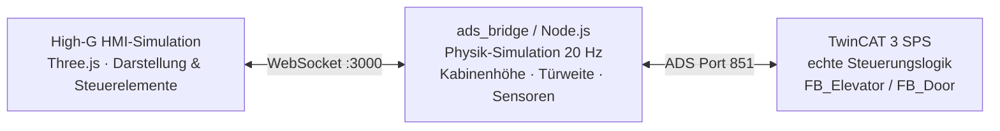

# Bereich 01 — IT-OT-Integration

Dieser Bereich verbindet meine berufliche Basis (Automatisierungstechnik / SPS-Programmierung)
mit moderner IT: Eine industrielle Steuerung (TwinCAT 3, IEC 61131-3) wird über eine
selbst gebaute Node.js-Brücke an eine browserbasierte 3D-Visualisierung gekoppelt —
als Hardware-in-the-Loop-Simulation, ganz ohne physische Anlage.

## Projekte

| Projekt | Technologien | Status | Doku |
|---|---|---|---|
| **Aufzug Digital Twin** (`Elevator_TC`) | TwinCAT 3 (Structured Text), Node.js, `ads-client`, WebSockets, Three.js, **Physik-Simulation (20 Hz)** | Funktionaler Prototyp — läuft lokal als HIL-Simulation mit TwinCAT-Trial-Runtime, kein physischer Aufbau | [Projekt-README](TwinCAT%20Projekts/README.md) |

## Datenfluss (Kompaktansicht)



Dieser **Digital Twin** bildet eine reale Aufzugsteuerung vollständig ab — inklusive Physik-Simulation (Kabinenhöhe, Türweite, Sensoren) in der Node.js-Bridge. Die Besonderheit: Die SPS-Logik ist **echt** (reale TwinCAT-Laufzeit), nur die Mechanik ist simuliert. Die Node.js-Bridge berechnet die physikalischen Größen im 50-ms-Zyklus und speist daraus simulierte Sensorsignale zurück in die SPS — die Steuerung merkt keinen Unterschied zu einer realen Anlage (Hardware-in-the-Loop-Prinzip).

## Was dieser Bereich zeigt

* **Schrittketten-Design:** Typsichere Enum-Schrittkette (`eStep : E_ElevatorState`) mit
  expliziten Zehner-Nummern statt nackter Integer-Schritte.
* **Industrie-Patterns:** Latch-Pattern (Flankenspeicher) für Fahrrufe, damit auch kürzeste
  Impulse nie verloren gehen.
* **Sicherheits-Vorrang auf SPS-Ebene:** Not-Halt und Feuerwehr-Modus übersteuern jede
  Fahrt und sind vom HMI aus nicht umgehbar.
* **3 Etagen, Zweiknopf-Sammelsteuerung:** Richtungsabhängige Außenrufe (↑/↓) plus
  Innenrufe, verwaltet in einer Rufwarteschlange.
* **IT-OT-Brücke:** ADS-Kommunikation (Beckhoff-Protokoll) nach WebSocket übersetzt —
  SPS-Variablen live im Browser.

## Struktur

```
01_IT-OT_Integration/
└── TwinCAT Projekts/
    ├── README.md                  <- Detail-Doku: Architektur, Entwurfsentscheidungen, Inbetriebnahme
    └── Elevator_TC/
        ├── Elevator_TC/           <- SPS-Projekt (POUs, DUTs, GVL)
        ├── ads_bridge/            <- Node.js ADS-WebSocket-Brücke + Physik-Simulation
        └── elevator_3d_demo.html  <- 3D-HMI (Three.js, Single-File)
```

Details zu Architektur und Inbetriebnahme: **[TwinCAT Projekts/README.md](TwinCAT%20Projekts/README.md)**
