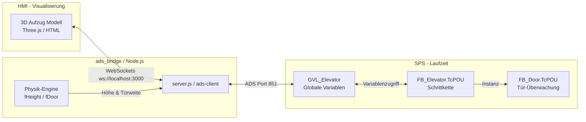

# TwinCAT 3 Aufzugsteuerung (OT-Lernprojekt)

Dieses Projekt enthält eine speicherprogrammierbare Steuerung (SPS) für einen 3-Etagen-Personenaufzug, realisiert in TwinCAT 3 unter Verwendung von Structured Text (ST) nach IEC 61131-3. Die Steuerung ist an eine physikalische Echtzeitsimulation (Digital Twin) über eine Node.js ADS WebSocket Bridge angebunden.

---

## Systemarchitektur & Datenfluss

Die Steuerung ist als geschlossener Regelkreis (Hardware-in-the-Loop) aufgebaut:



---

## Logische Konzepte & Entwurfsentscheidungen

### 1. Enum-basierte Schrittkette (`eStep`)
Die Schrittkette wird über das Zustands-Enum `E_ElevatorState` (abgeleitet vom Basistyp `DINT`) in der Variable `eStep` gesteuert. Dieser Ansatz nutzt die TwinCAT-Möglichkeit, Enum-Werten explizite Zahlenwerte zuzuweisen (z. B. `eIdle := 1`, `eDoorClosing := 11`, `eMovingUp := 30`).
*   **Warum?**
    1.  **Sprechende Konstanten im Code (Selbstdokumentierend):** Man muss beim Debuggen oder Lesen nicht mehr durch den Code scrollen, um die Bedeutung nackter Integer-Schritte (wie `11` oder `30`) nachzuschlagen. Im `CASE eStep OF`-Block sieht man direkt den aussagekräftigen Enum-Namen (z. B. `eDoorClosing`), der als selbstdokumentierende Konstante dient und Tippfehler ausschließt.
    2.  **Numerische Flexibilität:** Da das Enum auf Integers basiert, verhält es sich intern wie eine klassische Schrittkette. Dies erlaubt numerische Bereichsabfragen (z. B. Fahrtrichtungssperren für alle Schritte von 30 bis 38).
    3.  **Vergleich zu Siemens (STEP 7 / TIA Portal):** Im Gegensatz zu klassischen Siemens-Steuerungen, bei denen Enums historisch nicht als native, typsichere Konstrukte existieren, bietet TwinCAT 3 (basierend auf der 3. Ausgabe der IEC 61131-3) native objektorientierte Features und starke Typ-Enums.
    4.  **ADS-Observability & Robustheit:** Der Zustand wird über ADS als einfacher Integer an die Node.js-Simulation und das 3D-HMI übertragen. Durch die festen Zahlenwerte bleibt die Kommunikation auch bei Online-Changes absolut robust.

### 2. Das Latch-Pattern (Flankenspeicher)
Tastereingaben für Fahrrufe (`bCallFloor1` etc.) sind flüchtige Impulse. Im Funktionsbaustein `FB_Elevator` werden diese über steigende Flanken (`R_TRIG`) erfasst und sofort in einem Speicher-Array (`arCallQueue[n] := TRUE`) gelockt.
*   **Warum?** Dies garantiert, dass die Steuerung auch bei extrem kurzen Tastendrücken oder Signalstörungen (Prellen) keinen Ruf verliert. Der Ruf wird erst dann gelöscht, wenn der Aufzug die Etage erreicht hat und die Tür vollständig geöffnet wurde.

### 3. Sicherheitsgerichtete Vorrangsteuerung
Im SPS-Code ist eine strikte Priorisierung implementiert:
1.  **Not-Halt (`GVL_Elevator.bEmergency = FALSE`)**: Unterbricht sofort jede Fahrt, setzt die Motorausgänge zurück und öffnet aus Sicherheitsgründen die Kabinentür (`eEmergency`).
2.  **Feuerwehr-Modus (`GVL_Elevator.bFireAlarm = TRUE`)**: Ignoriert alle ausstehenden Rufe, schließt die Tür, fährt den Aufzug direkt ins Erdgeschoss (Evakuierungsebene) und öffnet die Tür dort dauerhaft (`eFireMode`).

### 4. Node.js ADS Physik-Simulation
Da die reine SPS-Logik keine physikalischen Trägheiten enthält, simuliert die ADS-Bridge (`server.js`) bei 50ms Zykluszeit (20 Hz) das mechanische Verhalten des Aufzugs:
*   Liefert die SPS `bMotorUp = TRUE`, steigt die virtuelle Höhe `fHeight` kontinuierlich an.
*   Erreicht `fHeight` das Toleranzband einer Etage, schaltet die Bridge den zugehörigen Etagensensor in der SPS aktiv — z. B. bei 44 % – 56 % den Sensor `bSensorFloor2` für das 1. OG (Zählweise: EG = Floor 1, 1. OG = Floor 2, 2. OG = Floor 3).

---

## Inbetriebnahme

### 1. SPS-Projekt aktivieren
1.  Öffne das SPS-Projekt `Elevator_TC/Elevator_TC.sln` in Visual Studio / TwinCAT.
2.  Trage deine lokale AMS Net ID in `ads_bridge/server.js` ein (zu finden in TwinCAT unter *System ➔ Router*; für die lokale Runtime funktioniert häufig `127.0.0.1.1.1`).
3.  Übersetze das Projekt und aktiviere die Konfiguration (Konfigurationsmodus ➔ Run-Modus).

### 2. Node.js ADS Bridge starten
```bash
cd ads_bridge
npm install
npm start
```
Die Bridge verbindet sich mit dem lokalen ADS-Port `851`.

### 3. Visualisierung öffnen
Öffne `elevator_3d_demo.html` im Webbrowser, um den Fahrstuhl in 3D zu steuern und die Schrittkette live zu beobachten.
