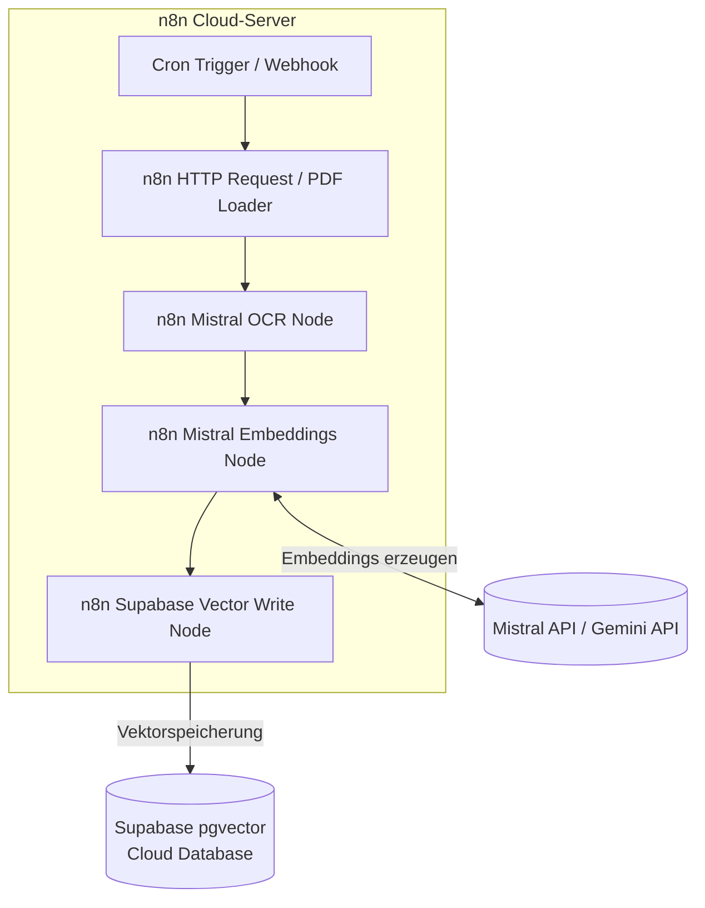

# Lokales RAG-System (Retrieval-Augmented Generation)

Eine lokale Wissensdatenbank mit Hybrid-Suche (`hybrid_search`) und automatisierter API-Fallback-Steuerung. Das System ermöglicht semantisch-lexikalische Suchen über Dokumenten-Chunks und generiert präzise Antworten mit strikten Quellenangaben.

---

## 🏛️ Evolution der Architektur

Dieses Projekt dokumentiert den Übergang von einem visuellen Prototypen hin zu einer eigenständigen, kostenoptimierten Software-Architektur:

### Entwurf 1: n8n Cloud-Workflow (Workflow-Design-Instrument)
Der erste Entwurf diente als **visuelles Workflow-Design-Instrument**. n8n bot hier eine hervorragende Möglichkeit, die logischen Pfade der API-Verkabelung schnell zu entwerfen und zu verifizieren. Es erzeugte jedoch laufende Cloud-Infrastrukturkosten und Abhängigkeiten von No-Code-Servern.



### Entwurf 2: Lokale Python-Pipeline (100% Kostenfrei & Algorithmen-Kontrolle)
Um **jegliche laufenden Serverkosten komplett zu eliminieren (0 €)**, die visuelle GUI-Komplexität von n8n abzulösen (die sich nur schwer in Git versionieren oder automatisiert testen lässt) und volle Kontrolle über die Datenverarbeitung zu behalten, wurde n8n komplett entfernt. Das System wurde in eine eigenständige Python-Codebasis überführt. Diese führt die logischen Schritte lokal aus, bietet eine direkte Code-Steuerung über komplexe Algorithmen (RRF, Satzgrenzen-Chunking, pgvector-Anbindungen) und stellt eine intelligente API-Fallback-Steuerung bei Schnittstellen-Ausfällen bereit. *(Hinweis: Da für Embeddings und Textgenerierung weiterhin externe APIs wie Gemini und Mistral genutzt werden, fließen Abfragedaten zur Verarbeitung in die Cloud, jedoch ohne zusätzliche SaaS-Zwischenstationen wie n8n-Cloud).*

```mermaid
flowchart TD
    %% Subgraph 1: Datenanlegung (Ingestion)
    subgraph Data_Ingestion ["1. Datenanlegung (Ingestion)"]
        doc[Dokument: PDF / MD / JSON] -->|1. Einlesen| ingest_py[ingest.py]
        ingest_py -->|2. Mistral OCR bei PDFs| OCR[Mistral OCR API]
        OCR -->|Markdown Text| ingest_py
        ingest_py -->|3. Absatzbasiertes Chunking & <br/>Satz-Splitting bei > 1000 Zeichen| chunk[Text-Chunks]
        chunk -->|4. Batch-Anfrage| mistral_emb[Mistral API: mistral-embed]
        mistral_emb -->|1024-D Embeddings| chunk
        chunk -->|5. INSERT| supabase[(Supabase Postgres DB)]
    end

    %% Subgraph 2: Datenabfrage & Chat
    subgraph Data_Query ["2. Datenabfrage & Chat (Q&A)"]
        user_q[Suchanfrage / Frage] -->|1. Abfrage| query_py[query_db.py]
        query_py -->|2. Abfrage einbetten| mistral_emb_q[Mistral API: mistral-embed]
        mistral_emb_q -->|1024-D Query Embedding| query_py
        query_py -->|3. Hybrid Search: Vektorsuche & Volltextsuche| supabase
        supabase -->|4. Reciprocal Rank Fusion Ranking| top_chunks[Top 5 Context Chunks]
        top_chunks -->|5. Prompt: Kontext + Frage| gemini[Gemini API: gemini-1.5-flash]
        gemini -->|6. Generierte Antwort mit Zitaten [1]| user_q
        
        %% Fallback-Verbindung
        gemini -.->|Fallback bei API-Fehler| mistral_chat[Mistral API: open-mixtral-8x22b]
        mistral_chat -.->|Antwort| user_q
    end
```

---

## 🔄 Interaktions-Workflow & Datenfluss

Das Zusammenspiel zwischen den Modellen, der Python-Logik und der Datenbank gliedert sich in zwei eigenständige Abläufe:

### 1. Datenanlegung (Ingestion-Pfad)
1. **Einlesen:** `ingest.py` liest lokale Dokumente (PDFs, Markdown oder JSON-Dateien) ein. PDFs werden über die leistungsfähige **Mistral OCR API** vollständig in Markdown konvertiert, um Tabellen- und Textstrukturen sauber zu erhalten.
2. **Chunking & Splitting:** Der Text wird primär **absatzbasiert** gesplittet. Sollte ein Absatz die Zielgröße von 1000 Zeichen überschreiten, wird er an logischen Satzgrenzen (`.` / `!` / `?` gefolgt von Leerzeichen) in kleinere, semantisch geschlossene Chunks zerlegt (Schutz vor Kausalverlusten, keine Komma-Splits).
3. **Vektorisierung:** Für jeden Text-Chunk wird über die **Mistral API** (`mistral-embed`) ein 1024-dimensionaler Vektor (Embedding) berechnet.
4. **Speicherung:** Der Text, der berechnete Vektor sowie umfangreiche Metadaten (Dateiname, MD5-Hash, Seitenzahl) werden in die PostgreSQL-Tabelle `documents` in Supabase geschrieben.

### 2. Datenabfrage & Chat (RAG-Pfad)
1. **Frage-Einbettung:** Bei einer Benutzeranfrage (z. B. `python query_db.py "Wie lauten die Bedingungen für X?"`) berechnet das System zuerst das Embedding der Frage über die **Mistral API** (`mistral-embed`).
2. **Datenbank-Abfrage (Hybrid Search & RRF):** Der Fragevektor und die Frage im Klartext werden an die Datenbank gesendet. Dort wird über eine benutzerdefinierte SQL-Funktion eine kombinierte Suche ausgeführt:
   - **Semantische Suche:** Findet die Chunks mit der höchsten Ähnlichkeit im Vektorraum (über `pgvector` Cosinus-Ähnlichkeit mit HNSW-Index).
   - **Lexikalische Suche:** Führt eine klassische Keyword-Volltextsuche auf dem Text aus.
   - Beide Listen werden über den **Reciprocal Rank Fusion (RRF)** Algorithmus gewichtet und zu einer Gesamt-Rangliste verschmolzen. Die Top 5 Chunks werden zurückgeliefert.
3. **Kontext-Injektion & Antwort-Generierung:** Die abgerufenen Text-Chunks werden als Kontext in das System-Prompt injiziert und an die **Gemini API** (`gemini-1.5-flash`) übermittelt. Gemini formuliert eine präzise deutsche Antwort und referenziert die genutzten Quellen über Inline-Zitate (z. B. `[1]`). Sollte Gemini ausfallen (z. B. Kontingentsgrenzen), weicht das System automatisch auf das **Mistral API-Chat-Modell** aus.

### 🧪 Verifikation der semantischen Nähe (Demo-Workflow)
Die Funktionsfähigkeit der Vektorisierung und die Codierung von Bedeutung als Nähe im Zahlenraum wurde über das Testskript [test_embeddings.py](test_embeddings.py) (Mistral Embedding-API `mistral-embed`, 1024-D Vektoren) erfolgreich nachgewiesen:

| Wort-Vergleich | Kosinus-Ähnlichkeit | Semantische Interpretation |
| :--- | :--- | :--- |
| `Hund` ↔ `Katze` | **0.7174** (71,74 %) | Hohe semantische Nähe (beide sind Säugetiere/Haustiere) |
| `Hund` ↔ `Auto` | **0.6589** (65,89 %) | Geringere semantische Nähe (Säugetier vs. unbelebtes Fortbewegungsmittel) |

**Einordnung:** Das semantisch verwandte Paar (Hund/Katze) erreicht eine messbar höhere Kosinus-Ähnlichkeit als das unverwandte Paar (Hund/Auto). Der absolute Abstand ist mit ~0,06 klein — entscheidend ist aber die Rangfolge: Der Embedding-Raum sortiert verwandte Begriffe näher zueinander. Diese Plausibilitätsprüfung bestätigt die Grundannahme, auf der die semantische Retrieval-Komponente der RAG-Engine aufbaut.

---

## 🛠️ Technische Kernkomponenten (Python)

Das System besteht aus drei zentralen Python-Komponenten:

### 1. Vektordatenbank-Initialisierung (`init_db.py`)
- Richtet die relationale Datenbank ein (PostgreSQL) und aktiviert die Erweiterung `pgvector` für Vektorsuchen.
- Erstellt Tabellen für die Text-Chunks, Embeddings und Metadaten (Quelle, Dateiname) sowie die passenden Indizes (HNSW/IVFFlat) für schnelle Vektorähnlichkeits-Suchen.
- Legt die Datenbankfunktionen für die **Hybrid Search** und das **RRF-Ranking (Reciprocal Rank Fusion)** an.

### 2. Chunking & Ingestion (`ingest.py`)
- Liest Quell-Dokumente (z. B. Markdown, PDFs) ein und zerschneidet sie **absatzbasiert** in Text-Chunks. Um Informationsverluste zu vermeiden, werden übergroße Absätze (über 1000 Zeichen) automatisch an logischen Satzgrenzen (Satzzeichen `.` / `!` / `?` gefolgt von Leerzeichen) in kleinere Chunks unter 1000 Zeichen zerlegt.
- Generiert für jeden Chunk einen Vektor (Embedding) mit dem Modell `mistral-embed` (1024 Dimensionen).
- Schreibt Chunks, Vektoren und Metadaten in die Datenbank.

### 3. Hybrid-Search & Chat-Generator (`query_db.py`)
- Führt bei einer Benutzerfrage eine **Hybrid Search** aus:
  1. **Semantische Suche (Vektor-Distanz):** Findet Chunks mit ähnlicher Bedeutung.
  2. **Lexikalische Suche (Keyword/BM25):** Findet exakte Übereinstimmungen (z. B. Produktnummern, Artikelbezeichnungen, Eigennamen).
- Verschmilzt beide Trefferlisten über **RRF (Reciprocal Rank Fusion)** und holt die Top-Kandidaten.
- **Generierungs-Hierarchie:** Standardmäßig wird die **Gemini API** (`gemini-1.5-flash`) als primäres LLM aufgerufen, um die Antwort auf Deutsch mit strikten Inline-Quellenangaben zu formulieren.
- **Ausfallsicherheit (API-Fallback):** Schlagen API-Aufrufe an das Standardmodell (Gemini) fehl (z. B. bei Kontingentsüberschreitung), weicht das System vollautomatisch auf die **Mistral API** (`open-mixtral-8x22b`) als Ausweich-LLM aus.

---

## 📈 Chronologie & Entwicklungs-Lernpfad

Um die Funktionsweise von RAG-Systemen von Grund auf zu verstehen, wurde die Implementierung entlang eines 10-stufigen Lernpfads aufgebaut. Die einzelnen Phasen und Meilensteine sind wie folgt in der Codebasis umgesetzt:

### 🎓 Der 10-Stufen-Entwicklungsweg
1. **Schritt 1: Tokenizer-Grundverständnis**
   - Kennenlernen des Konzepts von Tokens und IDs (Zahlenraum). Verständnis, wie Text in Token-IDs zerfällt.
2. **Schritt 2: Semantische Vektoren & Ähnlichkeit (Hund, Katze, Auto)**
   - **Ziel:** Plausibilitätsprüfung, dass Bedeutung als Nähe im Zahlenraum codiert ist.
   - **Umsetzung:** Implementiert im Testskript [test_embeddings.py](test_embeddings.py). Es lädt Embeddings von der Mistral-API und vergleicht die Kosinus-Ähnlichkeiten als Plausibilitätsprüfung der semantischen Nähe (Hund/Katze = 0.7174 vs. Hund/Auto = 0.6589).
3. **Schritt 3: Vektordatenbank & Schema-Design**
   - **Ziel:** Erstellung des Datenbankschemas.
   - **Umsetzung:** [init_db.py](init_db.py) aktiviert die `pgvector`-Erweiterung in Supabase (PostgreSQL) und erstellt die Tabelle `documents` mit HNSW-Indizes für 1024-dimensionale Vektoren.
4. **Schritt 3b: OCR-Indexierung (PDF -> Markdown)**
   - **Ziel:** Strukturierung chaotischer PDFs (z. B. Tabellenerhalt).
   - **Umsetzung:** In [ingest.py](ingest.py) integrierte Konvertierung via Mistral OCR REST API.
5. **Zusatz-Schritt: Lektions-Konvertierung (JSON -> Markdown / Ingestion)**
   - **Ziel:** Import strukturierter Lektionsdaten (JSON-Export einer Online-Lernplattform) in das RAG-System.
   - **Umsetzung:**
     - **Skript 1:** `convert_json_to_md.py` (lokales Hilfsskript, wegen der Kurs-Rohdaten bewusst nicht versioniert) liest einen JSON-Export mit Lektions-Transkripten ein und erzeugt 251 sauber formatierte Markdown-Lektionen mit strukturierten Notizen und Video-Transkripten auf der Festplatte.
     - **Skript 2:** Der JSON-Parser in [ingest.py](ingest.py) liest diese Daten direkt im RAM ein und bereitet sie für das Chunking und Embedding vor.
6. **Schritt 4, 5 & 6: Chunking & Vektor-Ingestion**
   - **Ziel:** Dokumente zerlegen, einbetten und speichern.
   - **Umsetzung:** [ingest.py](ingest.py) zerschneidet Texte absatzbasiert (mit 1000-Zeichen-Satzgrenzen-Fallback), berechnet 1024-D Vektoren über die Mistral API (`mistral-embed`) und speichert sie in Supabase.
7. **Schritt 7: Semantische Suche (Naive RAG)**
   - **Ziel:** Einfaches Q&A auf Vektorähnlichkeit.
   - **Umsetzung:** Vektor-Retrieval-Schritt in [query_db.py](query_db.py) via Kosinus-Ähnlichkeit.
8. **Schritt 8: Hybrid Search & RRF (Advanced RAG)**
   - **Ziel:** Präzises Auffinden von Keywords (z. B. Eigennamen, Produkt- und Artikelnummern).
   - **Umsetzung:** SQL-Datenbankfunktion `hybrid_search` kombiniert semantische Vektorsuche und lexikalische Keyword-Suche (BM25) via **Reciprocal Rank Fusion (RRF)**. Implementiert im Retrieval-Schritt von [query_db.py](query_db.py).
9. **Schritt 9 & 10: RAG-Chatbot mit quellenbelegten Antworten**
   - **Ziel:** Antwortgenerierung mit verifizierten Quellen-Zitaten.
   - **Umsetzung:** [query_db.py](query_db.py) injiziert die Top 5 Chunks in das System-Prompt und generiert über die **Gemini API** eine präzise deutsche Antwort mit Inline-Quellenzitaten (z. B. `[1]`). Bei API-Fehlern greift das Fallback auf Mistral (`open-mixtral-8x22b`).

---

## 🚀 Installation & Start (Lokal)

### 1. Abhängigkeiten installieren
Stelle sicher, dass du Python 3.10+ installiert hast, und installiere die Pakete:
```bash
pip install -r requirements.txt
```

### 2. Umgebungsvariablen einrichten
Erstelle eine `.env`-Datei im Projektordner:
```env
DB_HOST=dein-db-host
DB_NAME=postgres
DB_USER=postgres
DB_PASSWORD=dein-passwort
DB_PORT=5432
MISTRAL_API_KEY=dein-key
GEMINI_API_KEY=dein-key
```

### 3. Datenbank initialisieren
```bash
python init_db.py
```

### 4. Dokumente einlesen (Ingestion)
Lege deine Quelldateien bereit und starte den Import:
```bash
python ingest.py
```

### 5. Fragen an die Wissensdatenbank stellen
```bash
python query_db.py --query "Wie lauten meine Urlaubsansprüche?"
```
*Die Antwort wird mit exakten Quellenangaben (z. B. `[Personalhandbuch.pdf, S. 4]`) ausgegeben.*

---

## 🛡️ Datenschutz (DSGVO) & Skalierbarkeit im Unternehmenseinsatz

Für eine Überführung dieses Prototyps in ein datenschutzkonformes Unternehmensumfeld müssen folgende Aspekte der Systemarchitektur berücksichtigt werden:

### 1. Der Weg zur DSGVO-Konformität (EU-Hosting)
Da das System sensible Personaldaten verarbeitet, ist die Nutzung öffentlicher, globaler Consumer-APIs datenschutzrechtlich nicht zulässig. Zwei Migrationspfade stehen zur Verfügung:
*   **EU-gehostete Cloud-APIs (Empfohlen für KMUs):** Umstellung der Endpunkte auf in der EU (z. B. Region Frankfurt) gehostete Cloud-Dienste (z. B. Google Cloud Vertex AI, Mistral AI oder Microsoft Azure OpenAI). Durch den Abschluss eines Enterprise-Datenverarbeitungsvertrags (DPA) wird garantiert, dass die Daten DSGVO-konform verarbeitet und **nicht** für das Training der Modelle verwendet werden.
*   **Lokaler On-Premise-LLM-Betrieb:** Ausführen von Open-Source-Modellen (z. B. LLaMA 3.1 oder Mixtral) auf unternehmenseigenen Servern via `Ollama` oder `vLLM`. Dadurch verlassen keine Daten das interne Firmennetzwerk.

### 2. Der Skalierungs-Flaschenhals bei lokaler Hardware (Multi-User-Problem)
Bei der Entscheidung für ein lokales On-Premise-LLM muss die Gleichzeitigkeit (Concurrency) berücksichtigt werden:
*   **Der Hardware-Engpass:** Ein lokales LLM benötigt erhebliche GPU-Ressourcen (VRAM). Während eine einzelne Consumer-GPU (z. B. RTX 4090) Anfragen eines einzelnen Nutzers flüssig verarbeitet, führt die **gleichzeitige Nutzung durch mehrere Mitarbeiter** zu massiven Latenz-Engpässen. Die GPU muss Anfragen sequenzieren oder in großen Batches verarbeiten, was ohne extrem teure Enterprise-Server-Hardware (z. B. NVIDIA A100/H100-Cluster) zu Antwortzeiten im Minutenbereich führt.
*   **Fazit:** Für kleine und mittlere Unternehmen (KMUs) bietet die Nutzung von in der EU gehosteten, dedizierten Cloud-APIs die beste Balance aus DSGVO-Konformität, unbegrenzter Skalierbarkeit und niedrigen Infrastrukturkosten.
