# 02 — Softwareentwicklung (IT)

Dieser Bereich bündelt die reinen IT-Software-Projekte des Portfolios: eine Flask-Webanwendung, ein systemweites Windows-Diktier-Tool, eine semantische Wissensdatenbank (RAG) und eine deklarative Dokumenten-Pipeline — plus eine kleine Canvas-Demo. Die übergreifenden Architektur-Entscheidungen sind im [Root-README](../README.md#architektur-entscheidungen) dokumentiert; die technischen Details stehen in den jeweiligen Projekt-READMEs.

---

## Projektübersicht

| Projekt | Stack | Status (ehrlich) | Doku |
|---|---|---|---|
| **Concertify** (Konzert-Playlists) | Python, Flask, SQLite, Server-Sent Events; Clients für Spotify (spotipy/OAuth), Ticketmaster, setlist.fm, Eventim, Bandsintown, Tavily, Gemini | Funktionaler Prototyp — Single-User, läuft nur lokal, kein Deployment | [README](concertify/README.md) |
| **typeFREE** (Diktier-Tool) | Python, OpenAI Whisper (`whisper-1`, direkt + OpenRouter-Fallback), OpenRouter/Gemini 2.0 Flash (Textglättung), globale Keyboard-Hooks, System-Tray, pytest | Produktiv im täglichen Eigeneinsatz (Windows); 67 automatisierte Prüfungen; mitlaufende Kostenrechnung im Tray; Android-Companion eingestellt (siehe unten) | [README](typeFREE/README.md) |
| **RAG-System** (Wissensdatenbank) | Python, FastAPI, PostgreSQL/`pgvector`, Mistral `mistral-embed` (1024-D), Hybrid-Suche aus Vektor- und BM25-Suche (RRF) | Funktionaler Prototyp (CLI + Web-UI) — Einzelnutzer, kein Rechte-/Mandantenkonzept | [README](RAG-Systeme/README.md) |
| **Document Automation** | Node.js, `docx` (OpenXML), Puppeteer, `pdf-lib` | Stabil als lokales Einzelplatz-Tool; Daten anonymisiert, Ausgaben nicht versioniert | [README](document_automation/README.md) |
| **Eichhörnchen-Spiel** | HTML5 Canvas, Vanilla JS (eine Datei) | Abgeschlossen — Rapid-Prototyping-Demo, keine Weiterentwicklung geplant | [README](eichhoernchen_spiel/README.md) |

Schnellstart-Befehle für alle Projekte stehen gesammelt im [Root-README](../README.md#schnellstart).

---

## Architektur & Datenflüsse

Das Diagramm zeigt die fünf versionierten Projekte und ihre externen Schnittstellen. Document Automation und das Eichhörnchen-Spiel laufen vollständig lokal ohne externe Dienste.

```mermaid
flowchart LR
    subgraph Lokal [Rein lokal — keine externen Dienste]
        DocAuto[Document Automation<br/>JSON → DOCX/PDF-Pipeline]
        Spiel[Eichhörnchen-Spiel<br/>Canvas-Demo]
    end

    Concertify[Concertify<br/>Flask · SQLite · SSE]
    TypeFree[typeFREE<br/>Windows-Client · Hotkey Alt+Ä]
    RAG[RAG-System<br/>FastAPI · ingest.py · query_db.py]

    subgraph Konzertdaten [Konzert- & Setlist-Quellen]
        TM[(Ticketmaster)]
        SFM[(setlist.fm<br/>~2 Anfragen/s pro IP)]
        Eventim[(Eventim)]
        BIT[(Bandsintown)]
    end

    Spotify[(Spotify Web API)]
    Tavily[(Tavily Search)]
    Gemini[(Google Gemini)]
    G2F[(Gemini 2.0 Flash via OpenRouter)]
    Whisper[(OpenAI Whisper)]
    Mistral[(Mistral AI)]
    PG[(PostgreSQL/pgvector<br/>lokal oder Supabase)]

    Concertify -->|OAuth via spotipy · Playlists erstellen| Spotify
    Concertify --> TM
    Concertify --> SFM
    Concertify --> Eventim
    Concertify --> BIT
    Concertify -->|Verifikation & Fallback-Recherche| Tavily
    Concertify -->|Künstler-Zuordnung| Gemini

    TypeFree -->|Audio-Transkription| Whisper
    TypeFree -->|Textglättung via OpenRouter| G2F

    RAG -->|Embeddings & Chat| Mistral
    RAG -->|Fallback-QA| Gemini
    RAG -->|Vektor- & BM25-Suche| PG
```

Innerhalb von Concertify ist der Code strikt geschichtet (`routes → services → domain → repositories`, mit Unit-Tests je Schicht unter [tests/](concertify/tests/)) — dokumentiert in [dual_engineering_system.md](concertify/docs/dual_engineering_system.md).

---

## Eingestellte Mobile-Prototypen (Pivot-Begründungen)

Zwei Android-Prototypen wurden bis zum funktionsfähigen Proof of Concept entwickelt und danach bewusst eingestellt. Sie sind **nicht Teil des Repositories** — dies ist die zentrale Stelle, an der die Gründe dokumentiert sind.

### Concertify Android (React Native / Expo) — der Rate-Limit-Pivot

Die setlist.fm-API limitiert global auf **~2 Anfragen pro Sekunde und IP**. Eine Multi-User-Mobile-App hätte dieses Kontingent sofort erschöpft — dauerhafte API-Sperren wären ohne erhebliche zusätzliche Server- und Lizenzkosten nicht vermeidbar gewesen. Der Pivot zu einem lokalen Single-User-Flask-Server ([concertify/](concertify/README.md)) löst den IP-Konflikt vollständig, bei null Infrastrukturkosten. Lange Sync-Läufe fängt die Web-App über Server-Sent Events mit Live-Fortschritt und atomare JSON-Snapshots ab. Erkenntnisse aus dem Prototyp (zweistufiges Caching: Rohdaten speichern, Filter lokal anwenden) flossen in die Web-Version ein.

### typeFREE Android-Companion — an der Plattform-Sandbox gescheitert

Das Kernversprechen von typeFREE — diktierten Text systemweit in *jede* fremde App einfügen — funktioniert unter Windows über globale Keyboard-Hooks und Clipboard-Injektion. Auf Android verhindert die App-Sandbox genau das: Aus einer Expo-/React-Native-App heraus gibt es keinen systemweiten Textzugriff auf andere Apps (z. B. WhatsApp), und Overlay-Beschränkungen des Systems schränkten das geplante Floating-Bubble-Konzept zusätzlich ein. Der Prototyp blieb ein kurzes Proof of Concept und wurde verworfen.

### Warum die Prototypen nicht versioniert sind (Sicherheits-Note)

API-Schlüssel, die clientseitig in einer verteilten APK liegen, lassen sich per Dekompilierung extrahieren. Beide Codebasen wurden deshalb vom Git-Tracking ausgeschlossen. Wo OAuth nötig war (Spotify), kam der PKCE-Flow zum Einsatz, der ohne `Client Secret` auf dem Endgerät auskommt — das Prinzip „keine Keys in verteilten Clients" ist im [Root-README](../README.md#security--privacy-by-design) als Portfolio-Regel festgehalten.
