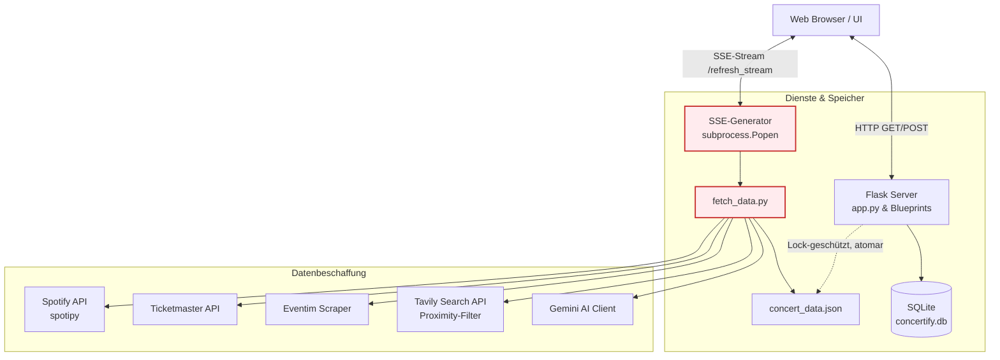

# Concertify — Konzert-Playlist-Generator (Flask & SSE)

Eine lokale Web-App, die aus gefolgten Spotify-Künstlern automatisch Playlists für bevorstehende Konzerte erstellt. Die Applikation importiert die Follows über die Spotify-API, sucht Konzerte in frei konfigurierbaren Städten sowie Festival-Lineups (z. B. Rock im Park) und generiert Playlists auf Basis echter Live-Setlists (setlist.fm).

---

## Architektur

Layered Architecture mit klarer Schichtentrennung — jede Schicht hat ihren eigenen Testspiegel unter `tests/` (180 Unit- und UI-Tests, Laufzeit ~2 s):

| Schicht | Ordner | Verantwortung |
|---|---|---|
| Domain | `domain/` | Reine Datenmodelle (Artist, Concert, Setlist, Song) ohne Framework-Abhängigkeiten |
| Repositories | `repositories/` | Persistenz hinter Interfaces: JSON-Datei (Konzertdaten) und SQLite (Setlist-Snapshots) |
| Services | `services/` | Geschäftslogik: Playlist-Import/-Speichern, Setlists, Song-Status, Support-Act-Reihenfolge |
| Routes | `routes/` | Flask-Blueprints (HTTP-Schicht) |
| External | `external/` | Schutzmechanismen für Fremd-APIs (u. a. setlist.fm-Tageskontingent) |



Die SQLite-Datenbank (`concertify.db`, Tabelle `setlist_snapshots`) versioniert benannte Setlist-Stände. Das Schema führt `user_id` (Default `local`) von Anfang an mit, damit ein späterer Multi-User-Ausbau ohne Migration der Bestandsdaten auskommt.

---

## Design-Entscheidungen

### 1. Server-Sent Events (SSE) für lange Suchläufe
Die Konzertsuche (`fetch_data.py`) kann wegen API-Kontingenten mehrere Minuten dauern. Um HTTP-Timeouts zu vermeiden, wird sie über `subprocess.Popen` entkoppelt; die Standardausgabe wird zeilenweise als SSE-Stream (`text/event-stream`) live an die Weboberfläche gereicht.
*   **Abbruch-Erkennung:** Schließt der Benutzer den Browsertab, wirft Flask eine `GeneratorExit`-Exception. Der Server fängt sie ab und beendet den Subprozess per `terminate()` — keine Zombie-Prozesse.

### 2. Atomares JSON-Schreiben
Web-Requests und Hintergrund-Suche greifen parallel auf `concert_data.json` zu. Alle Schreibzugriffe laufen deshalb durch eine zentrale Funktion (`_save_concert_data`): globaler Thread-Lock, Schreiben in eine temporäre Datei, dann atomares Umbenennen per `Path.replace()`. Ein Absturz mitten im Schreibvorgang kann die Datei so nicht korrumpieren.

### 3. setlist.fm-Kontingente: Zählen statt Hoffen
Die setlist.fm-API (Free Tier) erlaubt 1440 Requests pro Tag und sperrt bei Überschreitung die IP für 24 Stunden. Drei Mechanismen greifen ineinander:
*   **Tageskontingent-Zähler:** `external/setlistfm_quota.py` zählt jeden API-Call thread-sicher in einer JSON-Datei mit und stoppt bei einem Soft-Limit von 1000 — bewusst 30 % unter dem harten Limit, damit die Web-UI immer Restbudget behält. (Rate-Limiter-Pattern: Die eigene Software kennt ihr Kontingent, statt 429-Fehler zu provozieren.)
*   **429-Behandlung:** Antwortet die API dennoch mit `429 Too Many Requests`, wertet `setlist_client.py` den Retry-Header aus und pausiert zwischen Folge-Requests konservativ 1,5 Sekunden.
*   **Persistentes Caching:** Einmal abgerufene Setlists werden dauerhaft in `concert_data.json` gespeichert; erneute Suchen bedienen sich aus dem lokalen Cache statt neuer API-Calls.

### 4. Tavily Proximity-Check (Distanz-Filter gegen False Positives)
Tavily durchsucht das Web nach Tourdaten — Tour-Seiten listen aber meist alle weltweiten Termine. Der `TavilyConcertClient` akzeptiert ein Datum deshalb nur, wenn es im Suchtext innerhalb eines Fensters von 400 Zeichen (`_WINDOW = 400`) um ein Schlüsselwort der gesuchten Stadt steht (`_extract_date_near_city`). Für die Default-Stadt Hamburg existiert zusätzlich ein kuratierter Venue-Katalog („Barclays Arena", „Stadtpark", …), der die Trefferqualität weiter erhöht. Das verhindert z. B., dass ein Berlin-Termin einem Hamburg-Konzert zugeordnet wird.

---

## Setup & Start

### 1. Abhängigkeiten installieren
```bash
pip install -r requirements.txt
```

### 2. `.env`-Datei konfigurieren
Erstelle eine `.env`-Datei basierend auf [.env.example](.env.example):
```env
SPOTIFY_CLIENT_ID=dein_client_id
SPOTIFY_CLIENT_SECRET=dein_client_secret
SPOTIFY_REDIRECT_URI=http://127.0.0.1:8888/callback
TICKETMASTER_API_KEY=dein_ticketmaster_key
TAVILY_API_KEY=dein_tavily_key
GEMINI_API_KEY=dein_gemini_key
CONCERT_CITIES=Hamburg
ACTIVE_FESTIVALS=Rock im Park
```

### 3. Server starten
```bash
python app.py
```
Öffne `http://localhost:5000` im Browser.

---

## Testen

Die Testsuite spiegelt die Schichtenarchitektur (`tests/domain/`, `tests/repositories/`, `tests/services/`, `tests/external/`, `tests/db/`) und ergänzt UI-nahe Tests für die wichtigsten Endpunkte:

```bash
pytest tests/
# 180 passed
```
