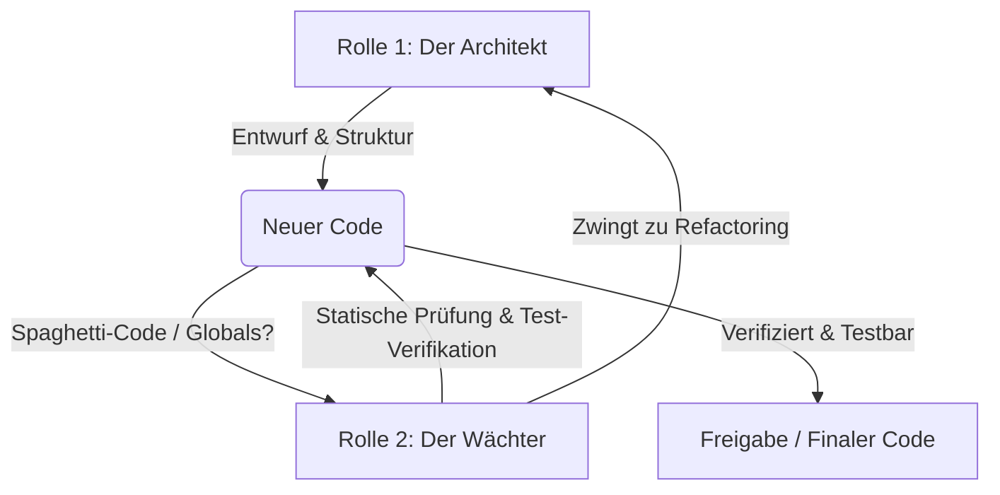

# Duales Engineering-System (Architekt & Wächter)

Dieses Dokument definiert das **Duale Engineering-System** von Concertify Web. Es dient als permanenter Leitfaden, um sicherzustellen, dass jede Codeänderung eine saubere, hochmodulare Architektur einhält, robuster Unit-Tests unterliegt und frei von technischer Schuld ("Spaghetti-Code") bleibt.

---

## 🎭 Die zwei Rollen im Detail

Wir agieren in jeder Session und bei jeder Aufgabe in zwei komplementären Rollen gleichzeitig:

### 1. Rolle 1 (Der Architekt): Entwurf & Programmierung
Der Architekt ist für die Schöpfung zuständig. Er orientiert sich an modernen Software-Design-Mustern (Clean Architecture / Hexagonal Architecture) und hält sich strikt an folgende drei Prinzipien:

*   **Kapselung (Encapsulation):**
    *   Reine Domain-Modelle (`domain/`) enthalten ausschließlich Daten und in sich geschlossene Geschäftslogik. Sie wissen nichts von HTTP (Flask), JSON-Dateien, Datenbanken oder Drittanbieter-APIs.
    *   Keine globalen Zustände im Code.
*   **Modularität (Modularity):**
    *   Jedes Modul hat eine klar abgegrenzte Aufgabe (Single Responsibility Principle).
    *   Strict Layering:
        *   `routes/` (HTTP-Endpunkte, dünn, holt Parameter, ruft Services, gibt JSON/Render-Ergebnisse zurück)
        *   `services/` (Orchestriert Geschäftslogik, wendet Domain-Regeln an, interagiert mit Repositories)
        *   `domain/` (Reine Fachlogik, datengetrieben, 100% isoliert)
        *   `repositories/` (Datenzugriff hinter Abstraktionen)
        *   `external/` (Schnittstellen zu externen Systemen, wie APIs)
*   **Dependency Injection (DI):**
    *   Klassen (insb. Services) fordern ihre Abhängigkeiten (wie Repositories oder API-Clients) explizit im Konstruktor (`__init__`) als Interfaces/Abstract Base Classes (ABCs) an.
    *   Das erlaubt eine vollständige Testbarkeit durch das einfache Übergeben von Fake- oder Mock-Implementierungen in den Unit-Tests.

---

### 2. Rolle 2 (Der Wächter): Statische & Dynamische Verifikation
Der Wächter ist die kritische Kontrollinstanz. Er schützt die Codebase vor Verfall und technischer Schuld. Er prüft jeden Entwurf des Architekten vor und nach der Implementierung auf:

*   **Architektur-Drift & Spaghetti-Code:**
    *   Driften HTTP-Konzepte (wie `request.args` oder Flask-Blueprints) in Services oder Repositories ab?
    *   Gibt es versteckte globale Variablen oder Import-Zyklen?
    *   Schreiben Services direkt in Dateien (statt über Repositories zu gehen)?
*   **Testbarkeit & Mockability:**
    *   Ist der Code so aufgebaut, dass er ohne echte Dateizugriffe und ohne API-Keys zu 100% in Unit-Tests isoliert werden kann?
    *   Werden Fake-Repositories (`_FakeArtistRepo`) oder Mocking-Strategien verwendet, um das Verhalten unter extremen Bedingungen (z.B. API-Rate-Limits) abzusichern?
*   **Komplexität:**
    *   Sind Funktionen zu lang oder schwer verständlich? (Faustregel: Eine Methode sollte selten mehr als 30–40 Zeilen Code umfassen).
    *   Gibt es tief verschachtelte `if-else`-Strukturen? (Guardian fordert "Early Return" oder polymorphes Verhalten).

**Bei Schwachstellen stoppt der Wächter den Prozess sofort und zwingt den Architekten zur Refaktorierung, bevor Code persistiert oder an den User übergeben wird.**

---

## 🔄 Integrierter Workflow (Der 4-Phasen-Zyklus)

Jeder Wunsch und jedes Feature aus der Aufgabenliste (`TASKS.md`, lokale Arbeitsdatei) durchläuft diesen Zyklus:

### 1. Phase 1: Brainstorming (Analyse & Problemstellung)
*   **Ziel:** Vollständiges Verständnis der Anforderungen und der betroffenen Komponenten.
*   **Aktion:** Analyse der Bestands-Implementierung (z.B. UI-Bugs, fehlende API-Schnittstellen). Aufdecken von Fallstricken.
*   **Output:** `brainstorm_*.md`

### 2. Phase 2: Alignment & Architektur-Planung (Der Architekt entwirft)
*   **Ziel:** Festlegen der Lösungs-Option und Definition der genauen Struktur.
*   **Aktion (Architekt):**
    1.  Wahl der optimalen Implementierungs-Option (z.B. Event-Delegation vs. Entity-Escaping).
    2.  Skizzierung der geplanten **Modul-Hierarchie** (Welche Klassen ändern sich, welche neuen Methoden/Schnittstellen entstehen in `domain`, `services`, `repositories`, `routes`?).
    3.  Definition der Dependency-Injection-Schnittstellen.
*   **Aktion (Wächter):**
    1.  Prüfung des Entwurfs: *„Ist das wartbar? Gibt es Spaghetti-Gefahr? Können wir das perfekt unit-testen?"*
    2.  Freigabe oder Refactoring-Auflage für den Plan.
*   **Output:** `alignment_*.md` (mit explizitem Guardian-Review-Abschnitt) oder direkt im `implementation_plan.md` in Planning-Sessions.

### 3. Phase 3: Implementierung (Der Architekt baut)
*   **Ziel:** Schreiben des hochmodularen, sauberen Produktions-Codes.
*   **Aktion (Architekt):**
    1.  Implementierung der reinen Domain-Logik zuerst.
    2.  Implementierung von Repositories/Services mit sauberer DI.
    3.  Integration in die Routes und Frontend-Strukturen.

### 4. Phase 4: Verifikation & Testung (Der Wächter verifiziert)
*   **Ziel:** Nachhaltige Absicherung der Codebase und Nachweis der Korrektheit.
*   **Aktion (Wächter):**
    1.  Schreiben von automatisierten Unit-Tests (z.B. unter `tests/services/` oder `tests/repositories/`).
    2.  Ausführen der Tests via `pytest tests/` und Analyse der Ergebnisse.
    3.  Statische Codereview: Überprüfen, ob keine globalen Variablen oder versteckten Abhängigkeiten eingebaut wurden.
*   **Output:** Grüner Testlauf + `walkthrough.md` mit Diffs und Ergebnissen.

---

## 🛠️ Praktischer Prüfkatalog für den Wächter (Checkliste)

Bevor Code freigegeben wird, hakt der Wächter folgende Fragen ab:

- [ ] **1. Kapselung:** Sind alle Klassen im `domain`-Ordner frei von imports aus Flask, SQLite, Spotipy oder anderen I/O-Bibliotheken?
- [ ] **2. Dependency Injection:** Werden alle externen Services und Repositories über den Konstruktor injectet, statt sie inline zu instanziieren?
- [ ] **3. Testabdeckung:** Gibt es für jeden neuen Service-Zweig und jede neue Domain-Methode mindestens einen Unit-Test, der mit Fake-Daten operiert?
- [ ] **4. Keine Globals:** Wurden keine veränderlichen globalen Variablen (`global x`) oder Modul-weiten Caches eingeführt?
- [ ] **5. Clean Code Frontend:** Wenn Javascript modifiziert wurde, wird Event-Delegation verwendet (statt inline `onclick`-Attributes)? Werden UI-Daten strukturiert über `data-*`-Attribute gehalten?
