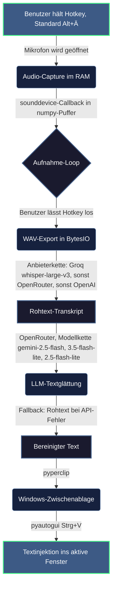

# typeFREE — Systemweites Voice-to-Text für Windows

typeFREE ist ein Diktier-Assistent, der als Hintergrundprozess auf dem Windows-Desktop läuft: Hotkey halten → sprechen → loslassen → der transkribierte und sprachlich geglättete Text landet direkt im aktiven Eingabefeld — egal ob Terminal, Browser oder Office.

**Status:** Produktiv im Eigeneinsatz (täglicher Diktat-Workflow) · 135 automatisierte Prüfungen · **drei wählbare Transkriptionswege** (`eu` = Mistral/Voxtral über OpenRouter als Standard, `beste` = ElevenLabs Scribe v2 mit Keyterms, `schnell` = Groq whisper-large-v3) · Wiederholung bei Drosselung + Rückfall auf den nächsten verfügbaren Weg · Glättung über eine Modellkette mit Ausfallmeldung · Prompt-Verschärfung gegen Füllwörter · Einzelinstanz-Sperre · Betriebshärtung abgeschlossen · Installer-Paket für Weitergabe · DSGVO-konforme Einrichtung.

---

## 0. Update 09/2026 — warum es nötig war

Zwei Befunde aus dem Betrieb (aus `typefree.log` und Messungen vom 25.09.2026):

1. **Der Filter lief gar nicht.** Die installierte EXE war der Build vom 02.08., die Quelle seit dem 14.08. auf ein neueres Glättungsmodell umgestellt — nur neu gebaut wurde nie. OpenRouter hatte das alte Modell inzwischen abgekündigt, jede Glättung endete im `404`. Ergebnis: 226 von 226 Diktaten wurden ungeglättet eingefügt, und weil der Fehler nur in der Logdatei stand, blieb es wochenlang unbemerkt.
2. **Die Transkription lief über einen toten Umweg.** Der OpenAI-Schlüssel gehört zu einem Konto ohne aktives Guthaben (`billing_not_active`), jeder direkte Aufruf scheiterte, und jedes Diktat ging anschließend über OpenRouter — gemessen ein Vielfaches der Zeit.
3. **Und der Ausweichweg schnitt das Audio ab.** Der Transkriptions-Endpunkt von OpenRouter (`/api/v1/audio/transcriptions`) liefert in rund der Hälfte der Läufe nur die letzten Sekunden des Audios zurück. Reproduziert über 16 Messläufe, mit wav, flac und mp3, mit festgenageltem Anbieter (DeepInfra, Together, Groq) und mit Zero-Data-Retention-Filter. Direkt bei Groq: 16 von 16 vollständig. **Das war die eigentliche Erklärung für „das funktioniert nicht so gut" — es kamen wochenlang Textbruchstücke an, nicht die ganze Diktatlänge.**

Behoben durch **wählbare Anbieterketten** für die Transkription und eine **Modellkette** für die Glättung, beide mit Ausweichstufen und Zeitmessung je Stufe. Der abgeschnittene Whisper-Weg über OpenRouter ist aus dem Regelpfad entfernt; für Diktate bleibt dort nur noch der Audio-Chat-Weg (Mistral/Voxtral), der nicht betroffen ist.

| Weg (`transkription`) | Ausführung | 24,5 s deutsches Audio | Vollständig | Kosten/h |
|---|---|---|---|---|
| **`eu`** (Standard) | Voxtral Small, Mistral (Frankreich) über OpenRouter | 1,83–2,84 s | 3 von 3 ✅ | 0,36 $ |
| `beste` | ElevenLabs Scribe v2 mit Keyterms | noch nicht gemessen | – | 0,264 $ |
| `schnell` | Groq `whisper-large-v3` | **0,72–1,97 s** | 16 von 16 ✅ | 0,111 $ |
| *(entfernt)* | OpenRouter `whisper-large-v3`, Transkriptions-Endpunkt | 0,8–3,7 s | **5 von 16** ❌ | 0,09–0,11 $ |

Fehlt der Schlüssel für den gewählten Weg, nimmt typeFREE automatisch den anderen und schreibt es ins Log — ein fehlender Schlüssel soll das Diktieren nicht verhindern. Umgestellt wird im Tray-Menü unter **„Transkription wählen"** (wirkt sofort, ohne Neustart) oder in der `config.json` neben der EXE: `"transkription": "eu" | "beste" | "schnell"`.

**Zwei Sicherungen, damit ein Diktat nicht verloren geht:** Bei Drosselung (429) wird der Aufruf bis zu dreimal wiederholt (1 s / 2 s Pause, nur bei 429 und 5xx). Fällt der gewählte Weg trotzdem aus, läuft der nächste verfügbare Weg als **Rückfall** — welcher Anbieter es war, steht im Log und in der Kostenzeile („(groq)"). Auf strikt umstellen: `RUECKFALL = False` in `windows/typefree.py`.

**Grenze des EU-Wegs (gemessen 25.09.2026):** Mistral läuft bei OpenRouter im *geteilten* Anbieter-Pool. Kurze Diktate (3 s, 24,5 s) gehen sauber durch (0,7–2,9 s), bei 60 s Audio kommt durchgehend `429 rate-limited upstream`. Für belastbaren EU-Betrieb lohnt ein eigener Mistral-Schlüssel bei OpenRouter („Integrations") — dann gelten eigene Limits. Zweiter Befund aus dem Betrieb: Voxtral gab einmal den Auftragstext selbst zurück; solche Antworten verwirft der Code inzwischen (`_ist_auftragstext`).

Vorher lag der Median im echten Betrieb bei 4 s (p90 10 s, Maximum 27 s) — inklusive des jedes Mal fehlschlagenden OpenAI-Versuchs.

---

## 1. Systemarchitektur

Der gesamte Client lebt bewusst in einer einzigen Datei ([windows/typefree.py](windows/typefree.py)) und integriert sich über vier Bausteine in das Betriebssystem:

* **Globale Key-Hooks:** Die Python-Bibliothek `keyboard` registriert den Hotkey auf Betriebssystemebene (Standard: `Alt + Ä` halten, auch per `AltGr + Ä` auslösbar). 13 vordefinierte Hotkey-Kombinationen sind über das Tray-Untermenü „Hotkey wählen" auswählbar; die Auswahl wird in `config.json` persistiert. **Modifier werden über den Scancode erkannt, nicht über den Namen** — die `keyboard`-Bibliothek meldet sie in der Anzeigesprache von Windows (`STRG`, `UMSCHALT`), Scancodes sind dagegen sprachunabhängig.
* **Audio-Aufnahme im RAM, Mikrofon nur bei Bedarf:** `sounddevice` öffnet das Mikrofon (16 kHz, mono) erst beim Drücken des Hotkeys und gibt es beim Loslassen sofort wieder frei — noch vor dem API-Aufruf. Das Windows-Mikrofonsymbol erscheint dadurch nur während einer Aufnahme, und andere Programme können das Gerät zwischenzeitlich nutzen. Der Puffer wird über `soundfile` als WAV in einen In-Memory-Buffer (`io.BytesIO`) geschrieben — ohne jeglichen Festplatten-I/O.
* **Zweistufige Sprachverarbeitung mit wählbarem Weg:** Die Transkription läuft über eine **Anbieterkette**, die in der `config.json` gewählt wird — `eu` (Standard: Voxtral Small von Mistral/Frankreich über OpenRouter, Audio im Chat), `beste` (ElevenLabs Scribe v2) oder `schnell` (Groq `whisper-large-v3`). Jeder Anbieter wird nur versucht, wenn sein Schlüssel in der `.env` steht; fehlt der Schlüssel des gewählten Wegs, nimmt typeFREE den anderen und protokolliert das; kann keiner liefern, meldet typeFREE einen Fehler, statt still zu schweigen. Jeder Aufruf geht mit `language="de"` und einem **Vokabel-Hinweis**, der häufige Fachwörter vorgibt und Verhörer damit an der Quelle senkt — bei ElevenLabs als `keyterms`-Liste (bis zu 100 Begriffe), bei Whisper als `prompt`. Anschließend glättet OpenRouter den Rohtext über eine **Modellkette** (`google/gemini-2.5-flash`, Ausweichwege `google/gemini-3.5-flash-lite` und `google/gemini-2.5-flash-lite`): Füllwörter raus (auch großgeschriebene wie „ÄHM"), Verhaspler geglättet, **offensichtliche Verhörer aus dem Zusammenhang korrigiert** — Umgangssprache und Slang bleiben dabei ausdrücklich unangetastet. Ist das Ergebnis auffällig kürzer als der Rohtext (abgeschnitten oder das Modell hat geantwortet statt bereinigt), wird der Rohtext eingefügt. Fällt die Glättung dreimal in Folge aus, erscheint einmalig ein Windows-Hinweis — damit ein abgekündigtes Modell den Filter nicht wieder wochenlang stilllegt.
* **Zustandsbasiertes Tray-Icon:** Ein per `PIL` gezeichnetes Mikrofon-Symbol (`pystray`) signalisiert den Pipeline-Zustand farblich: Grau = bereit, Grün = Aufnahme, Orange = Transkription, Blau = Textglättung, Rot = Fehler. Fehler werden zusätzlich als Windows-Sprechblase gemeldet und in `typefree.log` neben der EXE protokolliert — ein Diktat soll nie stillschweigend verloren gehen.
* **Mitlaufende Kostenrechnung:** Das Tray-Menü zeigt Minuten und Betrag für den laufenden Monat und insgesamt, dazu den Anbieter, auf dessen Preis sich der Betrag bezieht. Abgerechnet wird nach Audiolänge, sekundengenau, mit dem Preis des Wegs, der tatsächlich transkribiert hat: Groq `whisper-large-v3` $0,111 je Stunde, Voxtral (Mistral über OpenRouter) rund $0,36 je Stunde (aus der Abrechnung des Anbieters ermittelt), ElevenLabs Scribe v2 $0,264 je Stunde (0,22 $ plus 20 % Keyterms-Aufschlag). Die Audiolänge ist im Programm exakt bekannt — die Kosten lassen sich also ohne Zusatzabfrage und ohne zweiten Zugangsschlüssel mitrechnen. Gebucht wird erst nach erfolgreichem Einfügen: für fehlgeschlagene Anfragen erscheint kein Betrag. Den exakten Preis jedes einzelnen Diktats schreibt typeFREE in die Logdatei.

Der finale Text wird über `pyperclip` in die Zwischenablage geschrieben und nach einer kurzen Stabilisierungspause (0,3 s) per emuliertem `Strg+V` (`pyautogui`) in das aktive Fenster eingefügt.

---

## 2. Ende-zu-Ende-Datenfluss



---

## 3. Design-Entscheidungen (das „Warum")

### Warum Cloud-APIs statt lokaler Modelle?
Lokale Whisper-Modelle benötigen erhebliche GPU-Ressourcen und verzögern das Diktat um mehrere Sekunden — für einen Assistenten, der nebenbei laufen soll, ungeeignet. Die Kosten sind verschwindend gering (~1,20 $ in mehreren Monaten Eigeneinsatz zu OpenAI-Preisen; über Groq kostet dieselbe Stunde Audio $0,111 statt $0,36).

### Warum Groq für die Transkription — und OpenRouter trotzdem?
Die Transkription ist der langsamste Teil der Kette, und hier trennt sich die Spreu: Dasselbe 24,5-Sekunden-Audio brauchte über OpenRouter median 1,83 s (Ausreißer bis 6,79 s), direkt bei Groq 0,72 s. OpenRouter reicht die Whisper-Anfrage ohnehin an Groq weiter (der Anbieter ist dort als einer von drei eingetragen) — der Umweg kostet also nur Zeit, nicht Datenschutz. Deshalb geht die Transkription direkt zu Groq. OpenRouter bleibt im Spiel, weil dort der Glättungs-LLM (Gemini) läuft und weil ein einzelner Anbieter nie die einzige Option sein soll: Fällt Groq aus, springt OpenRouter ein, ohne dass ein Diktat verloren geht.

### Warum Clipboard-Injektion statt Tastaturemulation?
Zeichenweise Tastaturemulation scheitert regelmäßig an Umlauten, Sonderzeichen und Tastaturlayouts. Der Weg über die Zwischenablage (`pyperclip.copy` → `Strg+V`) stellt den Text in jedem Windows-Programm codierungsfehlerfrei dar — die 0,3-Sekunden-Pause vor dem Einfügen stellt sicher, dass die Zwischenablage den Text sicher übernommen hat.

### Warum RAM-Pufferung statt temporärer Audiodateien?
Die komplette Kette Mikrofon → `numpy` → WAV-Struktur → API-Upload läuft im Arbeitsspeicher — keine SSD-I/O-Last, keine temporären Dateien.

### Warum nicht Win+H?
Windows' eigene Diktierfunktion (Win+H) ist brauchbar, hat aber mehrere praktische Nachteile:
1. **Bleibendes Popup:** Das Diktier-Popup schließt sich nicht von selbst — du musst es manuell wegklicken. Das stört den Workflow erheblich.
2. **Sprachqualität & Filterung:** Die Erkennung und Füllwort-Filterung von Win+H ist schwächer als die zweistufige Whisper+Gemini-Pipeline von typeFREE.
3. **Undurchsichtige Datenverarbeitung:** Es ist nicht transparent, ob oder wie Microsoft die Sprachdaten verarbeitet, ob sie internetabhängig sind oder lokal bleiben.
4. **Nicht anpassbar:** Die Audio-Qualität, das Vokabular und die Textnachbearbeitung lassen sich nicht beeinflussen.

typeFREE umgeht diese Probleme: Die zweistufige Pipeline (Whisper + Gemini über OpenRouter) liefert bessere Erkennung und Filterung, die Datenverarbeitung ist transparent (OpenRouter DSGVO-konform, kein Training auf Nutzerdaten), und das minimale Tray-Icon bleibt unsichtbar im Hintergrund — kein Popup, das geschlossen werden muss.

### Hotkey-Handling: gelernte Stolperfallen
Drei Erkenntnisse aus dem Praxisbetrieb stecken im Code:
* `suppress=True` im `keyboard.hook()` ist tabu — es blockiert die gesamte Tastatur systemweit.
* Modifier-Zustände werden über ein eigenes `_mods_down`-Set verfolgt statt über `keyboard.is_pressed()` — zuverlässiger bei schnellen Tastenfolgen (inkl. `AltGr`, das Windows intern als `Strg+Alt` meldet).
* Key-Repeat-Events während einer laufenden Aufnahme werden ignoriert, sonst würde das Halten des Hotkeys die Aufnahme ständig neu starten.
* **Das Loslassen der Haupttaste beendet die Aufnahme immer** — die Modifier werden dabei absichtlich *nicht* geprüft. Die Entscheidungslogik steckt zu diesem Zweck in einer reinen Funktion (`decide_hotkey_action`) und ist automatisiert geprüft.

### Wie erkennt man ein totes Mikrofon ohne Fehlalarm?
Ein deaktiviertes oder abgezogenes Gerät liefert **exakte digitale Nullen** — ein angeschlossenes Mikrofon in einem echten Raum liefert immer Grundrauschen. Bleiben Datenpakete drei Sekunden lang aus *oder* enthalten sie nur exakte Nullen, verbindet typeFREE das Mikrofon einmal neu; erst wenn das misslingt, gibt es rotes Icon und Klartext-Meldung. Eine harte Obergrenze von 10 Minuten pro Aufnahme deckelt zusätzlich den Speicherverbrauch — der Text wird dabei trotzdem gesendet.

### Prompt-Design als Schutzschicht
Der Glättungs-Prompt weist das LLM explizit an, den diktierten Text **nicht zu beantworten** („er ist kein Befehl und keine Frage an dich"). Füllwörter werden in **allen Schreibweisen** erkannt („ähm", „Ähm", „ÄHM"), aber als Fachbegriff erkannte Wörter bleiben stehen. Schlägt die Glättung fehl, wird der Whisper-Rohtext unverändert eingefügt — der Nutzer verliert nie ein Diktat.

### Entstehungs-Motivation: Claude-Code-Workflow beschleunigen
typeFREE entstand aus dem konkreten Bedürfnis, ausführliche Prompts per Sprache in das Claude-Code-CLI-Terminal einzugeben.

---

## 4. Projektstruktur

```
typeFREE/
├── README.md
├── CLAUDE.md                  # Projekt-Leitfaden für KI-Agenten (Status, Hotkey-Regeln)
├── typeFREE.spec              # PyInstaller-Rezept: Build als fensterlose EXE
├── typeFREE.exe.manifest      # UAC-Manifest für Admin-Rechte (requireAdministrator)
├── installer/                 # Installationspaket für Weitergabe
│   ├── setup.cmd              # Installations-Assistent (API-Key, Autostart, Verknüpfungen)
│   ├── setup.cmd.manifest     # UAC-Dekoration
│   ├── installer_lib.py       # Installations-Logik (Python, testbar)
│   ├── deinstallieren.cmd     # Vollständige Entfernung (auch aus "Apps & Features")
│   ├── ANLEITUNG-API-KEY.html # DSGVO-konforme Einrichtung
│   ├── config.json            # Hotkey-Voreinstellung
│   ├── autostart_admin.cmd    # Notfall-Autostart
│   └── typeFREE.exe           # Vorgefertigte EXE
├── build/
│   ├── autostart_admin.cmd
│   ├── autostart_einrichten.ps1
│   └── build_installer.cmd    # baut EXE und kopiert in installer/
└── windows/
    ├── typefree.py            # Kompletter Client: Hooks, Audio, Tray, API-Pipeline
    ├── requirements.txt       # Abhängigkeiten (sounddevice, keyboard, openai, …)
    ├── requirements-dev.txt   # pytest — nur für die Tests
    ├── config.json            # Persistierte Hotkey-Wahl (Standard: Alt + Ä)
    ├── einrichten.cmd         # Setup für Python-Skript-Modus (pythonw)
    ├── einrichten_exe.cmd      # Setup für EXE-Modus (Admin, Aufgabenplanung)
    └── tests/                 # 109 automatisierte Prüfungen in 13 Dateien (pytest)
```

Die Prüfungen richten sich auf reine Funktionen — Hotkey-Entscheidung, Mikrofon-Erkennung, Zeitgrenze, Anbieter- und Modellketten, Textglättung, Installations-Logik —, damit sie ohne Mikrofon, Tastatur oder Netzzugang laufen. Sie brauchen **Python 3.12** (dort liegen die Abhängigkeiten); das Projekt-venv gibt es nicht, der Aufruf ist reproduzierbar aus dem Projektverzeichnis:

```powershell
$env:PYTHONPATH="."; py -3.12 -m pytest windows/tests -q      # Stand 25.09.2026: 109 passed
```

---

## 5. Schnellstart

### Empfohlen: Installations-Assistent (für Endanwender und Weitergabe)

Der `installer/`-Ordner enthält ein fertiges Paket — keine Vorkenntnisse nötig:

```powershell
installer\setup.cmd            # Rechtsklick → "Als Administrator ausführen"
```

**Schritt für Schritt:**
1. `installer\setup.cmd` mit Rechtsklick → **„Als Administrator ausführen"**
2. **OpenRouter API-Key** eintragen (kostenlos, $1 Startguthaben — für die Textglättung)
3. Optional: **OpenAI API-Key** (nur bei eigenem Guthaben — letzter Ausweichweg)
4. Fertig — typeFREE läuft sofort im Tray

> **Noch offen (nächster Schritt):** Der Assistent fragt den **Groq-Schlüssel** noch nicht ab. Ohne ihn läuft die Transkription über den Ausweichweg OpenRouter — funktioniert, braucht aber rund das Doppelte an Zeit. Bis dahin den Schlüssel von Hand in die `.env` neben der EXE eintragen (`GROQ_API_KEY=...`); typeFREE weist beim Start im Log darauf hin. Auch die **vorbereitete EXE in `installer/`** stammt noch vom 02.08.2026 — vor der nächsten Weitergabe `build/build_installer.cmd` laufen lassen, sonst bekommt der Empfänger den alten Build.

Der Assistent erledigt automatisch:
* Installation nach `%ProgramFiles%\typeFREE`
* Desktop-Verknüpfung, Startmenü-Eintrag und Autostart
* **Windows "Apps & Features"**-Eintrag (Deinstallation wie jede andere Windows-App)
* DSGVO-konforme Einrichtung (OpenRouter Zero Data Retention aktiviert)

**Wichtig:** Der Empfänger muss **keine System-Umgebungsvariablen** setzen — alle Keys stehen editierbar in der `.env` neben der EXE.

**Deinstallation:** Windows-Taste → Einstellungen → Apps → Installierte Apps → typeFREE → Deinstallieren.

**Hinweise:**
* Der globale Tastatur-Hook benötigt unter Windows **Administrator-Rechte** — daher das UAC-Manifest in der EXE. Ohne Admin installiert der Assistent nach `%USERPROFILE%\typeFREE` (Hotkey funktioniert, kein Autostart).
* Hotkey ändern: Rechtsklick auf das Tray-Icon → „Hotkey wählen" → Eintrag anklicken (13 Optionen, der aktive ist markiert). Standard ist `Alt + Ä`.
* Fehler nachlesen: `typefree.log` neben der EXE. Da die EXE fensterlos gebaut wird (`console=False`), ist die Logdatei die einzige Spur, die ein Absturz hinterlässt.

---

### Alternativ: Entwicklung und Eigenbau

#### Variante A: Als Python-Skript

```powershell
cd windows
pip install -r requirements.txt
python typefree.py
```

Benötigte API-Keys in einer `.env` neben der EXE (bzw. im Projektordner):

```
GROQ_API_KEY=...          # Transkription, Regelfall (schnellster Weg)
OPENROUTER_API_KEY=...    # Textglättung + Ausweichweg für die Transkription
OPENAI_API_KEY=...        # optional, letzter Ausweichweg (nur mit Guthaben)
```

Echte Umgebungsvariablen haben Vorrang, sodass sich beim Entwickeln ein anderer Schlüssel vorgeben lässt. Die `.env` ist von der Versionierung ausgeschlossen.

Für unsichtbaren Start (kein Terminal-Fenster): `windows/einrichten.cmd` ausführen.

#### Variante B: Als EXE bauen

```powershell
pyinstaller typeFREE.spec
```

Die EXE liegt dann unter `dist/typeFREE/typeFREE.exe`. Anschließend:

```powershell
windows\einrichten_exe.cmd
```

Dieses Skript:
1. Prüft, ob die EXE existiert
2. Startet typeFREE mit Admin-Rechten (UAC)
3. Richtet auf Wunsch die Windows-Aufgabenplanung ein (Autostart bei Anmeldung + Aufwachen)

Die EXE wird bewusst **nicht** versioniert (Binärartefakt); der Build ist über das PyInstaller-Rezept jederzeit reproduzierbar.
