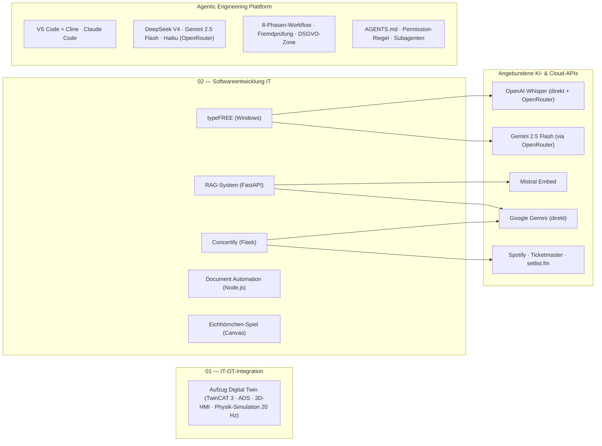

# Agentic Engineering — Portfolio: Software von der Web-Anwendung bis zur Maschinensteuerung

> **English summary:** Engineering portfolio of a software developer with an automation background (B.Sc. Electrical & Information Engineering). It covers two isolated domains: **IT** — web, voice-to-text, RAG and document-automation projects built with Python and Node.js — and **OT** — a TwinCAT 3 elevator control coupled with a Node.js ADS bridge and a Three.js 3D HMI as a hardware-in-the-loop simulation. All projects follow a disciplined, phase-based agentic-engineering workflow, documented at the end of this page.

Alle Projekte hier sind mit KI-Coding-Agenten entstanden — nach festem Regelwerk, nicht ad hoc.
Das Regelwerk dahinter ([AGENTS.md](AGENTS.md)) habe ich aus etablierten Praktiken
zusammengestellt und über mehrere Projekte an meine Arbeit angepasst; entstanden ist es neben
der Arbeit in der Automatisierungstechnik, heute wende ich es vor allem auf Anwendungssoftware an. Das Repository bündelt zwei getrennte Domänen:

* **[02_Softwareentwicklung_IT](02_Softwareentwicklung_IT/README.md):** Eigenständige Software-Projekte: Web-Anwendung (Flask), systemweites Diktier-Tool (Windows), semantische Wissensdatenbank (RAG) und deklarative Dokumentengenerierung.
* **[01_IT-OT_Integration](01_IT-OT_Integration/README.md):** Kopplung einer industriellen SPS-Steuerung (TwinCAT 3, Structured Text) mit einer browserbasierten 3D-Visualisierung über eine Node.js-ADS-Brücke — als Hardware-in-the-Loop-Simulation ohne physische Anlage.

Beide Domänen laufen vollständig isoliert und tauschen keine Daten aus.

---

## Projektübersicht

| Projekt | Stack | Status | Doku |
|---|---|---|---|
| **Aufzug Digital Twin** | TwinCAT 3 (Structured Text), Node.js, `ads-client`, WebSockets, Three.js | Funktionaler Prototyp (HIL-Simulation) | [README](01_IT-OT_Integration/TwinCAT%20Projekts/README.md) |
| **Concertify** (Konzert-Playlists) | Python, Flask, SQLite, Server-Sent Events, Spotify-/Ticketmaster-API | Funktionaler Prototyp (lokaler Einsatz) | [README](02_Softwareentwicklung_IT/concertify/README.md) |
| **typeFREE** (Diktier-Tool) | Python, OpenAI Whisper (`whisper-1`, direkt + OpenRouter-Fallback), OpenRouter/Gemini 2.5 Flash (Textglättung), Keyboard-Hooks, pytest | Produktiv im Eigeneinsatz (Windows); 67 automatisierte Prüfungen; mitlaufende Kostenrechnung | [README](02_Softwareentwicklung_IT/typeFREE/README.md) |
| **RAG-System** (Wissensdatenbank) | Python, FastAPI, PostgreSQL/`pgvector`, Mistral `mistral-embed` (1024-D), Hybrid-Suche (RRF) | Funktionaler Prototyp | [README](02_Softwareentwicklung_IT/RAG-Systeme/README.md) |
| **Document Automation** | Node.js, `docx` (OpenXML), Puppeteer, `pdf-lib` | Stabil (lokales Tool) | [README](02_Softwareentwicklung_IT/document_automation/README.md) |
| **Eichhörnchen-Spiel** | HTML5 Canvas, Vanilla JS (eine Datei) | Abgeschlossen (Rapid-Prototyping-Demo) | [README](02_Softwareentwicklung_IT/eichhoernchen_spiel/README.md) |

**Bewusst nicht versioniert:** Zwei mobile Prototypen (Concertify Android, typeFREE Android) wurden nach technischer Evaluierung eingestellt und sind nicht Teil des Repositories — u. a. weil API-Schlüssel in einer verteilten APK per Dekompilierung auslesbar wären. Die Pivot-Begründungen stehen im [Bereichs-README](02_Softwareentwicklung_IT/README.md).

### Portfolio-Landkarte



Detail-Diagramme (Datenflüsse, APIs, Schichten) liegen in den jeweiligen Projekt-READMEs.  
Das Data-Flow-Diagramm der IT-Projekte (02) findet sich im [zugehörigen Bereichs-README](02_Softwareentwicklung_IT/README.md#architektur--datenflüsse).

---

## Verzeichnisstruktur

```
├── .claude/
│   ├── settings.json                    # Durchgesetzte Permission-Regeln (deny/ask/allow)
│   ├── skills/                          # Ausführbare Agenten-Verfahren
│   │   ├── phase/                       #   8-Phasen-Workflow, nur auf Abruf (/phase)
│   │   ├── grill-me/                    #   Alignment-Interview (Phase 2)
│   │   ├── grillAnAgent/                #   Brainstorm-Grill (Phase 1)
│   │   └── critic/                      #   Fremdprüfung durch zweites Modell (pruefe.mjs)
│   └── agents/                          # Subagenten mit eigenem Kontextfenster
│       ├── rechercheur.md               #   Codesuche, gibt nur Fundstellen zurück
│       └── tester.md                    #   Prüfläufe, gibt nur Exit-Code und Fehlerzeilen zurück
├── 01_IT-OT_Integration/
│   └── TwinCAT Projekts/
│       ├── README.md
│       └── Elevator_TC/                # TwinCAT-3-Projekt
│           ├── Elevator_TC/            #   SPS-Code: FB_Elevator, FB_Door, E_ElevatorState …
│           ├── ads_bridge/             #   Node.js ADS-WebSocket-Brücke (server.js)
│           └── elevator_3d_demo.html   #   Three.js 3D-HMI
├── 02_Softwareentwicklung_IT/
│   ├── README.md
│   ├── concertify/                     # Flask-App: routes/ services/ domain/ repositories/ + tests/
│   ├── typeFREE/                       # Windows-Diktier-Client + Installer (typefree.py, installer/)
│   ├── RAG-Systeme/                    # ingest.py · query_db.py · main.py (FastAPI) · static/
│   ├── document_automation/            # build_cv.js · build_pdf.js · merge_pdfs.js
│   └── eichhoernchen_spiel/            # index.html (Canvas-Demo)
├── AGENTS.md                           # Die eine Quelle der Kernregeln (werkzeugübergreifend)
├── CLAUDE.md                           # Nur das Claude-Code-Spezifische + Import von AGENTS.md
├── sync-rules.ps1                      # Erzeugt die Bereichs-CLAUDE.md aus CLAUDE_EXTENDS.md
└── README.md
```

---

## Architektur-Entscheidungen

**1. TwinCAT: Hardware-in-the-Loop statt Physik in der SPS.** SPS-Laufzeiten haben keine native Physik. Statt die Steuerungslogik mit künstlichen Verzögerungen zu verfälschen, simuliert die Node.js-Brücke das mechanische Verhalten (Kabinenhöhe, Türen) im 50-ms-Zyklus und liefert simulierte Sensorwerte an die reale SPS-Logik zurück. Die Schrittkette nutzt ein typsicheres Enum (`eStep : E_ElevatorState`); Not-Halt und Brandfall haben auf SPS-Ebene Vorrang und sind vom HMI nicht übersteuerbar. → [Details](01_IT-OT_Integration/TwinCAT%20Projekts/README.md)

**2. Concertify: Pivot von Mobile zu lokalem Web-Server.** Die setlist.fm-API limitiert global auf ~2 Anfragen/Sekunde pro IP. Eine Multi-User-Mobile-App hätte dieses Kontingent sofort erschöpft; der Wechsel zu einem lokalen Single-User-Flask-Server löst den IP-Konflikt ohne Serverkosten. Lange Sync-Läufe werden über Server-Sent Events mit Live-Fortschritt und atomare JSON-Snapshots abgefedert. → [Details](02_Softwareentwicklung_IT/concertify/README.md)

**3. RAG-System: Ablösung von n8n durch eine Python-Pipeline.** Der erste Entwurf als visueller n8n-Cloud-Workflow ließ sich schlecht versionieren und nicht automatisiert testen. Die Migration zu Skripten ([ingest.py](02_Softwareentwicklung_IT/RAG-Systeme/ingest.py), [query_db.py](02_Softwareentwicklung_IT/RAG-Systeme/query_db.py)) macht die Kernlogik — absatz- und satzgrenzenbasiertes Chunking, Hybrid-Suche aus `pgvector`-Vektorsuche und BM25 via Reciprocal Rank Fusion — als testbaren, diffbaren Code sichtbar. → [Details](02_Softwareentwicklung_IT/RAG-Systeme/README.md)

**4. typeFREE: Clipboard-Injektion statt Tastatur-Simulation.** Diktate werden im RAM aufgezeichnet, per Whisper transkribiert, durch OpenRouter/Gemini 2.5 Flash von Füllwörtern befreit und über die Zwischenablage (`Strg+V`) in das aktive Fenster injiziert. Das Einfügen als ein Block statt zeichenweiser Tastensimulation vermeidet Umlaut-Codierungsfehler und Timing-Probleme. → [Details](02_Softwareentwicklung_IT/typeFREE/README.md)

**5. Document Automation: deklarative Dokumente statt manueller Formatierung.** Lebensläufe und Anschreiben werden aus strukturierten Daten per Code generiert (OpenXML/`docx`, Puppeteer-PDF-Rendering). Inhaltsänderungen können das Layout nicht mehr zerschießen; die Engine ist strikt von den privaten Bewerbungsdaten getrennt, die nie ins Repository gelangen. → [Details](02_Softwareentwicklung_IT/document_automation/README.md)

---

## Agentic Engineering als Methode

Alle Projekte sind mit KI-Coding-Agenten entstanden — nicht ad hoc, sondern entlang eines festen Regelwerks, das selbst Teil des Repositories ist.  
Dieser Abschnitt beschreibt nicht nur die Methode, sondern auch die **persönliche Reise**, die dahinter steht: 9 Monate Experimentieren mit Plattformen, Modellen und Kostenmodellen, deren Erkenntnisse in jeden Aspekt des Workflows eingeflossen sind.

### Meine Reise: Von Claude Code zum Multi-Modell-System

| Zeit | Setup | Warum? |
|---|---|---|
| **2025** | Erste Gehversuche: Chatbots personalisiert, System-Prompts mit Ingenieurs-Denkweise optimiert | Prä-Agenten-Ära — den Grundstein für strukturierte Prompt-Architektur gelegt |
| **Januar 2026** | Start mit **Claude Code** (Enterprise-Team-Lizenz, Sonnet, Opus) | Erster KI-Coding-Agent im professionellen Einsatz |
| **März–Mai 2026** | Berufliche Praxis: TwinCAT 3, VB.NET-HMI, IO-Listen-Generierung, Schaltplan-Vergleich | KI als "Experience-Partner" — schneller lernen, nicht langsamer; Vorreiter im Team gegen alte Denkweise |
| **Juni–Juli 2026** | **Antigravity** + Google One (2× 12 €) — Test günstigerer Alternative | Kosten sparen, aber unzufrieden mit Ergebnissen |
| **August 2026** | **VS Code + Cline** (Agent-Harness) + **OpenRouter** + Multi-Modell | Claude Code-Limits verschärft; DSGVO-konforme, kosteneffiziente Alternative gefunden |
| **August 2026** | Regelumbau: Kernregeln nach `AGENTS.md`, Workflow als Skill, Permission-Riegel, Subagenten | Erkenntnis: nicht die Regelgröße kostet das Kontingent, sondern die **Anzahl der Turns** — jede Phasengrenze verlangte eine Freigabe, ohne ein einziges maschinelles Prüf-Gate |

**Das heutige Setup:** Nicht *ein* Tool, sondern ein orchestriertes System aus Plattformen und Modellen:

| Aufgabe | Werkzeug | Modell |
|---|---|---|
| Planung & Implementierung | VS Code + Cline | **DeepSeek V4** (kostengünstig) |
| Bildverarbeitung | VS Code + Cline (Modell-Wechsel) | **Gemini 2.5 Flash** (beste Bild-Interpretation) |
| Fremdprüfung (Critic) | OpenRouter (API-Gateway) | **Anthropic Haiku** (DSGVO-konform, andere Modellfamilie) |
| Alternativ-Plattform | Claude Code | Je nach Verfügbarkeit & Kontingent |

Antigravity wurde nach der Erprobung wieder verworfen — zu wenig Kontrolle über
das, was der Agent tatsächlich anfasst. Der Wechsel zwischen Claude Code und Cline
kostet heute nichts mehr, weil der Arbeitsstand in Dateien liegt und nicht im
Kontextfenster (siehe *Portabilität* weiter unten).

> **Die Kern-Erkenntnis:** Nicht das Tool entscheidet über Qualität, sondern das **System aus orchestrierten Modellen**, das je nach Aufgabe, Kosten und Compliance das passende Modell wählt.

### Phasenbasierter Entwicklungszyklus

Jedes Feature durchläuft acht Phasen: **Brainstorm → Alignment → Planung → Implementierung → Testing → Recap → Refactor → Commit**. Gearbeitet wird in kleinen vertikalen Slices mit atomaren Commits; am Phasenende wird der Agenten-Kontext geleert, weil Modelle bei wenig und präzisem Kontext am zuverlässigsten arbeiten. Drei Regeln stechen heraus:

* Im *Alignment* werden alle architektonischen Verzweigungen per Interview geklärt, bevor Code entsteht — der Agent trifft keine Gestaltungsentscheidung selbst.
* *Testing*, *Recap* und *Refactor* dürfen nie übersprungen werden.
* In den Phasen *Planung*, *Testing* und *Refactor* prüft ein **fremdes Modell** gegen (siehe unten). In der *Implementierung* ist das ausdrücklich untersagt: Kritik während des Bauens zerfasert die Umsetzung.

**Zwei Blöcke mit unterschiedlichem Charakter.** Die acht Phasen zerfallen in einen Dialog- und einen Ausführungsteil, und nur der erste braucht mich in jedem Schritt:

| Block | Phasen | Warum so | Permission-Modus |
|---|---|---|---|
| **Dialog** | 1–3 | Der Inhalt entsteht erst im Gespräch — hier gibt es nichts abzuarbeiten | `plan` (nur lesen) |
| **Ausführung** | 4–8 | Der Plan steht; der Agent läuft durch, mit **genau einem** Pflichtstopp nach Phase 4 | `acceptEdits` |

Der Pflichtstopp nach Phase 4 fällt bewusst nicht weg: Ob sich eine Oberfläche richtig bedienen lässt, kann kein Test beantworten. Das ist der einzige Punkt im Ausführungsblock, an dem ein Mensch wirklich gebraucht wird — und deshalb der einzige, an dem angehalten wird.

**Warum das ein bewusster Umbau war.** Vorher lag an jeder der sieben Phasengrenzen eine menschliche Freigabe, aber kein einziges maschinelles Prüf-Gate. Kontrolle wurde also mit meiner Zeit bezahlt statt mit Automatik — und genau daran ging das Kontingent kaputt, nicht an der Dateigröße der Regeln. Heute sitzt die Kontrolle an drei Stellen, die ohne mich funktionieren: dem freigegebenen `plan.md`, dem Prüfbefehl des Projekts mit Exit-Code, und den durchgesetzten Permission-Regeln. Ein Durchlauf ohne Zwischenfreigaben ist nur erlaubt, wenn alle drei vorhanden sind und es kein OT-/SPS-Code ist.

### Ein Regelwerk, vier Ebenen

Damit die Regeln nicht an mehreren Stellen auseinanderlaufen, gibt es genau **eine** Quelle — und sie liegt bewusst in der werkzeugneutralen Datei, nicht in der herstellerspezifischen:

| Datei | Rolle | Wann sie gilt |
|---|---|---|
| [AGENTS.md](AGENTS.md) | **Die Quelle:** Sprache, Leitplanken, Autonomiegrenze, Verifikationsregel | immer, in jedem Werkzeug |
| [CLAUDE.md](CLAUDE.md) | Nur das Claude-Code-Spezifische (Skills, Subagenten) + `@AGENTS.md` | immer, nur in Claude Code |
| `CLAUDE_EXTENDS.md` je Bereich | Zusatzregeln der Domäne: SPS-Namenskonventionen (Ungarische Präfixe, Zehner-Schrittketten) in OT, Design- und SEO-Vorgaben in IT | sobald eine Datei des Bereichs gelesen wird |
| [.claude/settings.json](.claude/settings.json) | Die Regeln, die **nicht** verhandelbar sind — durchgesetzt vom Harness, nicht vom Modell | in jedem Permission-Modus |

[sync-rules.ps1](sync-rules.ps1) erzeugt daraus die Bereichs-`CLAUDE.md`: ein Verweis auf die Wurzel-Datei plus die lokale Erweiterung.

**Warum `AGENTS.md` und nicht `CLAUDE.md` die Quelle ist.** Ich wechsle je nach Kontingent zwischen Claude Code und VS Code + Cline. Cline liest keine `CLAUDE.md`. `AGENTS.md` ist dagegen die Konvention, auf die sich die Werkzeuge 2026 geeinigt haben — Claude Code zieht sie per Import herein, Cline liest sie nativ, und beim nächsten Harness-Wechsel funktioniert sie ohne Zutun weiter. Eine Quelle, keine Kopie, kein Auseinanderdriften.

**Der Umbau dahinter:** Ursprünglich kopierte `sync-rules.ps1` das komplette Basis-Regelwerk in jede Bereichsdatei. Das erzeugte zwei Probleme — die Kopien konnten unbemerkt von der Quelle abdriften, und jeder Agent lud dieselben ~130 Zeilen ein zweites Mal in seinen Kontext. Heute steht dort ein zweizeiliger Verweis. Im zweiten Schritt wanderte der 8-Phasen-Workflow aus dem Dauerkontext in einen Skill, der nur auf `/phase` lädt: der permanent sichtbare Ablauf hatte dazu geführt, dass das Modell auf spätere Phasen vorgriff. Der dauerhaft geladene Regelanteil sank dabei von 136 auf 98 Zeilen.

### Bitten und Riegel — der Unterschied, der zählt

Eine Regel in einer Markdown-Datei ist eine **Bitte an das Modell**. Sie beschreibt, was der Agent tun *soll*. Was er tatsächlich *darf*, steht in [.claude/settings.json](.claude/settings.json) und wird vom Harness durchgesetzt — unabhängig davon, was das Modell gerade denkt oder wie ein Prompt formuliert ist.

| Ebene | Inhalt | Wirkung |
|---|---|---|
| `deny` | das private Chat-Archiv | technisch gesperrt, in jedem Modus |
| `ask` | `git push`, `npm publish`, `docker push` | alles, was den Rechner verlässt, braucht meine Freigabe |
| `allow` | git-Lesebefehle, `add`/`commit`, Prüfbefehle, Fremdprüfer | damit ein Durchlauf nicht an jedem Testlauf stehenbleibt |

Die `deny`-Zeile ersetzt eine frühere Absichtserklärung durch eine tatsächliche Sperre; die `ask`-Zeile macht aus „der Agent pusht nicht" einen Riegel. Erst dadurch wird Automatik verantwortbar: Die `allow`-Liste macht den Durchlauf überhaupt möglich, `ask` und `deny` machen ihn vertretbar.

### Portabilität über Werkzeuggrenzen

Der Zustand einer laufenden Arbeit liegt bei mir **in Dateien, nicht im Kontextfenster**: `brainstorm.md`, `alignment.md`, `plan.md`. Das ist der Grund, warum ein `/clear` nach jeder Phase nichts kostet — und derselbe Grund, warum ein Wechsel des Werkzeugs mitten im Projekt funktioniert.

| Ebene | Portabel? | Inhalt |
|---|---|---|
| `AGENTS.md` | überall | Kernregeln, Autonomiegrenze, Verifikationsregel |
| Übergabedateien | überall — es sind nur Markdown-Dateien im Repo | der Zustand der laufenden Arbeit |
| `.claude/skills`, `.claude/agents`, `.claude/settings.json` | nur Claude Code | Workflow, Subagenten, Permission-Riegel |

Wer in Cline weiterarbeitet, verliert den `/phase`-Skill und die Subagenten. Die Kernregeln und der Arbeitsstand bleiben.

### Ausführbare Skills statt Prosa-Regeln

Die heikelsten Stellen im Zyklus sind nicht als Merksatz formuliert, sondern als Verfahren mit festem Ablauf, Abbruchkriterium und einer Tabelle typischer Ausreden samt Gegenrede. Vier Skills liegen im Repository: [`phase`](.claude/skills/phase/SKILL.md) hält den Ablauf selbst vor und lädt nur auf Aufruf, [`grillAnAgent`](.claude/skills/grillAnAgent/SKILL.md) grillt den Brainstorm, und die beiden folgenden sind die eigentlichen Qualitätsgrills.

**[`grill-me`](.claude/skills/grill-me/SKILL.md) — der Grill *vor* dem Bauen.** Alignment als ausführbares Verfahren: erst ein Register aus 8–15 Annahmen zum Widersprechen, dann sokratische Einzelfragen — eine pro Nachricht, immer mit 2–4 konkreten Optionen und einer begründeten Empfehlung, sodass eine Antwort aus einem Buchstaben bestehen kann. Danach drei Angriffe auf das eigene Ergebnis (*„Das scheitert, wenn …"*), erst dann die `alignment.md`. Die eiserne Regel: keine Datei-Änderung am Zielprojekt, bevor das Alignment freigegeben ist. Zeichnen sich mehr als ~15 Fragen ab, gilt nicht die Fragenzahl als Problem, sondern der Slice — dann wird geteilt.

**[`critic`](.claude/skills/critic/SKILL.md) — der Grill *nach* dem Bauen.** Generator-Critic-Muster über zwei Modellfamilien: ein Modell baut, ein Modell einer anderen Familie prüft, weil beide unterschiedliche blinde Flecken haben. Zwei Konstruktionsprinzipien: Das fremde Modell bekommt den Code im Prompt übergeben — es liest keine Dateien und führt nichts aus. Und es liefert **Befunde, keine Urteile**: entschieden wird je Punkt vom Menschen, nie automatisch behoben. Einstiegspunkt ist [`pruefe.mjs`](.claude/skills/critic/pruefe.mjs), das Prompt, Format und Fehlerbehandlung mitbringt:

| Motor | Aufruf | Kontingent | Einschränkung |
|---|---|---|---|
| **Haiku via OpenRouter** (DSGVO-Standard) | `--openrouter` oder Flag-frei | API-Kosten | DSGVO-konform, Daten nicht zur Produktverbesserung; API-Key per Header |
| Gemini-API (Fallback) | `--gemini` | 1.500 Läufe/Tag | API-Schlüssel nötig, per Header übertragen — nie in der URL |
| Antigravity | `--agy` | 20 Läufe/Tag | kein Schlüssel nötig, max. 30.000 Zeichen |
| Codex (Sonderfall) | explizit | Monatskontingent | schärfer bei Nebenläufigkeit, nur auf ausdrücklichen Wunsch |

### Subagenten: Wegwerf-Kontext bleibt draußen

Ein Skill wird in den *Hauptkontext* geladen und kann mit mir reden. Ein **Subagent** hat ein eigenes Kontextfenster, arbeitet ab und gibt nur eine Zusammenfassung zurück — er kann nicht mit mir reden, spart dafür Tokens auch *während* der Arbeit. Die Entscheidungsregel ist eine einzige Frage: *Erzeugt dieser Schritt Material, das nie wieder gebraucht wird?*

| Subagent | Aufgabe | Was zurückkommt |
|---|---|---|
| [`rechercheur`](.claude/agents/rechercheur.md) | Codesuche in Phase 3 und 7 | Dateipfade mit Zeilennummern, max. zehn Zeilen Zusammenfassung — keine Dateiinhalte |
| [`tester`](.claude/agents/tester.md) | Prüfläufe in Phase 5 und nach jedem Refactoring | Exit-Code, Trefferzahl, je Fehlschlag Datei/Zeile/Meldung — keine Logs |

Beide laufen auf Haiku: Wegwerf-Arbeit darf auch günstig sein. Der `tester` repariert bewusst **nichts** — er meldet und hört auf. Sonst würde die Instanz, die den Fehler gemacht hat, ihr eigenes Ergebnis bewerten.

Testlogs und Suchtreffer sind der größte Wegwerf-Kontext überhaupt. Sie aus dem Hauptgespräch herauszuhalten ist das, was längeres Arbeiten in einer Sitzung überhaupt erst trägt — zusammen mit dem Prüfbefehl je Projekt.

### Was die Fremdprüfung messbar gelehrt hat

1. **Großer Prüfumfang kostet Befunde.** Gleicher Code, gleiches Modell: Bei 27.000 Tokens meldete der Critic einen schweren Befund (Feldzugriff auf ein möglicherweise nicht gesetztes Objekt). Im Wiederholungslauf mit 62.000 Tokens fehlte genau dieser Befund. Konsequenz: lieber drei gezielte Läufe über einzelne Dateien als einer über alles — das Kontingent ist reichlich, die Aufmerksamkeit des Modells ist der Engpass.
2. **Schweregrade sind unzuverlässig.** Dieselbe SQL-Injection kam je nach Modell als *kritisch* oder *hoch* zurück, ein sicherer Absturz als *mittel*. Jeder Befund wird deshalb nachgestuft und die Korrektur kenntlich gemacht, statt das Protokoll durchzureichen.
3. **Ein leeres Protokoll ist keine Freigabe.** Die Fremdprüfung findet andere Dinge als ein Testlauf, nicht dieselben — sie ersetzt die Testphase nicht.
4. **Fehlerausgaben nie unterdrücken.** Wird `stderr` verworfen, ist ein Kontingent- oder Authentifizierungsfehler nicht mehr von einem leeren Ergebnis zu unterscheiden. Genau daran ist der erste Aufbau mehrfach gescheitert.

### DSGVO-konforme Zone: OpenRouter als API-Gateway

Ein zentrales Merkmal der aktuellen Architektur: **OpenRouter dient als DSGVO-konformes API-Gateway**, das die Nutzung von Modellen (z. B. Anthropic Haiku für die Fremdprüfung) ermöglicht, ohne dass Daten zur Produktverbesserung verwendet werden dürfen.

| Aspekt | Umsetzung |
|---|---|
| Datenverarbeitung | OpenRouter verarbeitet Anfragen DSGVO-konform; keine Nutzung der Inhalte für Modell-Training |
| API-Key-Handling | Schlüssel per Header (nie in der URL), zusätzlich abgesichert durch `.env` und `.gitignore` |
| Kostenkontrolle | Pay-per-Use statt Abo — günstiger als Flatrate-Modelle bei geringem Volumen |
| Zukunfts-Roadmap | Concertify soll von direkter Gemini-API auf OpenRouter umgestellt werden |

### Grenze der Fremdprüfung: was das Repository nicht verlässt

Im kostenlosen Tier nutzt der Anbieter übermittelte Inhalte zur Produktverbesserung. Deshalb geht ausschließlich Code aus [02_Softwareentwicklung_IT](02_Softwareentwicklung_IT/README.md) an ein fremdes Modell. **SPS- und OT-Code aus [01_IT-OT_Integration](01_IT-OT_Integration/README.md), Kundendaten und alles unter NDA sind ausgenommen** — festgehalten als Bereichsdirektive in [CLAUDE.md](CLAUDE.md), nicht als guter Vorsatz.  
Selbst mit OpenRouter bleibt diese Grenze bestehen — DSGVO-konform heißt nicht automatisch "darf das Repository verlassen".

### Qualitäts-Gates: Architekt & Wächter

Jede größere Änderung durchläuft zwei komplementäre Rollen: Der **Architekt** entwirft (strikte Schichtung `routes → services → domain → repositories`, Dependency Injection über Konstruktoren), der **Wächter** prüft anschließend gegen einen festen Katalog:

| Check | Kriterium |
|---|---|
| Kapselung | Keine Schicht greift an einer anderen vorbei |
| Dependency Injection | Abhängigkeiten über Konstruktor/Abstraktionen, keine versteckten Globals |
| Testbarkeit | Kernlogik testbar ohne echte I/O |
| Komplexität | Methoden kompakt halten, Early Returns statt Verschachtelung |
| Frontend | Event-Delegation statt Inline-Handler |

Angewendet und dokumentiert ist das System im Concertify-Projekt: [dual_engineering_system.md](02_Softwareentwicklung_IT/concertify/docs/dual_engineering_system.md). Sichtbares Ergebnis ist die Testsuite unter [concertify/tests/](02_Softwareentwicklung_IT/concertify/tests/) (Unit-Tests je Schicht: `domain/`, `repositories/`, `services/`).

---

## Security & Privacy by Design

* **Secrets-Kapselung:** API-Schlüssel liegen ausschließlich in `.env`-Dateien, die per `.gitignore` ausgeschlossen sind. Eine [.env.example](02_Softwareentwicklung_IT/concertify/.env.example) dokumentiert die erwarteten Variablen, ohne Werte offenzulegen.
* **Keine Keys in verteilten Clients:** Die mobilen Prototypen wurden u. a. deshalb nicht versioniert, weil clientseitig eingebettete API-Schlüssel per Dekompilierung extrahierbar wären; für OAuth kam dort der PKCE-Flow zum Einsatz, der ohne `Client Secret` auf dem Endgerät auskommt.
* **Lokale Verarbeitung sensibler Daten:** Die Dokumentengenerierung läuft vollständig lokal; private Bewerbungsdaten sind vom versionierten Code getrennt und nicht Teil des Repositories.
* **Transparente Cloud-Grenzen:** Wo externe LLM-APIs genutzt werden (Whisper, Mistral, Gemini), ist das in den Projekt-READMEs ausgewiesen — inklusive der Datenflüsse.

---

## Schnellstart

### Concertify (Flask-Webapp)
```bash
cd 02_Softwareentwicklung_IT/concertify
pip install -r requirements.txt
python app.py
# → http://localhost:5000
```

### typeFREE (Windows-Diktier-Client)
```bash
cd 02_Softwareentwicklung_IT/typeFREE/windows
pip install -r requirements.txt
python typefree.py
# Läuft im Systemtray; Aufnahme per Alt + Ä (halten).
# Schlüssel stehen in einer .env neben dem Programm — nie im Code, nie in der EXE.
# Prüfungen: set PYTHONPATH=. && python -m pytest windows/tests -v
```

### RAG-System (Wissensdatenbank)
```bash
cd 02_Softwareentwicklung_IT/RAG-Systeme
pip install -r requirements.txt
python init_db.py      # Schema anlegen (PostgreSQL/pgvector, z. B. Supabase)
python ingest.py       # Dokumente einlesen und einbetten
python query_db.py     # CLI-Abfrage — alternativ: python main.py (FastAPI-Web-UI, Port 8000)
```

### Aufzug Digital Twin (TwinCAT + ADS-Brücke)
1. `01_IT-OT_Integration/TwinCAT Projekts/Elevator_TC/Elevator_TC.sln` in TwinCAT 3 öffnen, Konfiguration aktivieren, SPS in den Run-Modus versetzen.
2. Brücke starten:
   ```bash
   cd "01_IT-OT_Integration/TwinCAT Projekts/Elevator_TC/ads_bridge"
   npm install
   npm start
   ```
3. `elevator_3d_demo.html` im Browser öffnen.

### Eichhörnchen-Spiel
`02_Softwareentwicklung_IT/eichhoernchen_spiel/index.html` direkt im Browser öffnen — keine Abhängigkeiten.
