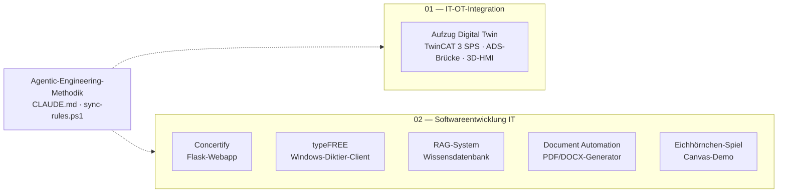

# Agentic Engineering — Portfolio: Software von der Web-Anwendung bis zur Maschinensteuerung

> **English summary:** Engineering portfolio of a software developer with an automation background (B.Sc. Electrical & Information Engineering). It covers two isolated domains: **IT** — web, voice-to-text, RAG and document-automation projects built with Python and Node.js — and **OT** — a TwinCAT 3 elevator control coupled with a Node.js ADS bridge and a Three.js 3D HMI as a hardware-in-the-loop simulation. All projects follow a **self-developed**, phase-based agentic-engineering workflow, documented at the end of this page.

Alle Projekte hier sind mit KI-Coding-Agenten entstanden — nach festem Regelwerk, nicht ad hoc.
Das Regelwerk dahinter ([CLAUDE.md](CLAUDE.md)) habe ich selbst entwickelt und über mehrere
Projekte verfeinert; entstanden ist es neben der Arbeit in der Automatisierungstechnik, heute
wende ich es vor allem auf Anwendungssoftware an. Das Repository bündelt zwei getrennte Domänen:

* **[02_Softwareentwicklung_IT](02_Softwareentwicklung_IT/README.md):** Eigenständige Software-Projekte: Web-Anwendung (Flask), systemweites Diktier-Tool (Windows), semantische Wissensdatenbank (RAG) und deklarative Dokumentengenerierung.
* **[01_IT-OT_Integration](01_IT-OT_Integration/README.md):** Kopplung einer industriellen SPS-Steuerung (TwinCAT 3, Structured Text) mit einer browserbasierten 3D-Visualisierung über eine Node.js-ADS-Brücke — als Hardware-in-the-Loop-Simulation ohne physische Anlage.

Beide Domänen laufen vollständig isoliert und tauschen keine Daten aus.

---

## Projektübersicht

| Projekt | Stack | Status | Doku |
|---|---|---|---|
| **Aufzug Digital Twin** | TwinCAT 3 (Structured Text), Node.js, `ads-client`, WebSockets, Three.js | Funktionaler Prototyp (HIL-Simulation) | [README](01_IT-OT_Integration/TwinCAT%20Projekts/README.md) |
| **Concertify** (Konzert-Playlists) | Python, Flask, SQLite, Server-Sent Events, Spotify-/Ticketmaster-API | Funktionaler Prototyp (lokaler Einsatz) | [README](02_Softwareentwicklung_IT/concertify/README.md) |
| **typeFREE** (Diktier-Tool) | Python, OpenAI Whisper (`whisper-1`), Groq (`llama-3.1-8b-instant`), Keyboard-Hooks | Produktiv im Eigeneinsatz (Windows) | [README](02_Softwareentwicklung_IT/typeFREE/README.md) |
| **RAG-System** (Wissensdatenbank) | Python, FastAPI, PostgreSQL/`pgvector`, Mistral `mistral-embed` (1024-D), Hybrid-Suche (RRF) | Funktionaler Prototyp | [README](02_Softwareentwicklung_IT/RAG-Systeme/README.md) |
| **Document Automation** | Node.js, `docx` (OpenXML), Puppeteer, `pdf-lib` | Stabil (lokales Tool) | [README](02_Softwareentwicklung_IT/document_automation/README.md) |
| **Eichhörnchen-Spiel** | HTML5 Canvas, Vanilla JS (eine Datei) | Abgeschlossen (Rapid-Prototyping-Demo) | [README](02_Softwareentwicklung_IT/eichhoernchen_spiel/README.md) |

**Bewusst nicht versioniert:** Zwei mobile Prototypen (Concertify Android, typeFREE Android) wurden nach technischer Evaluierung eingestellt und sind nicht Teil des Repositories — u. a. weil API-Schlüssel in einer verteilten APK per Dekompilierung auslesbar wären. Die Pivot-Begründungen stehen im [Bereichs-README](02_Softwareentwicklung_IT/README.md).

### Portfolio-Landkarte



Detail-Diagramme (Datenflüsse, APIs, Schichten) liegen in den jeweiligen Projekt-READMEs.

---

## Verzeichnisstruktur

```
├── 01_IT-OT_Integration/
│   └── TwinCAT Projekts/
│       ├── README.md
│       └── Elevator_TC/                # TwinCAT-3-Projekt
│           ├── Elevator_TC/            #   SPS-Code: FB_Elevator, FB_Door, E_ElevatorState …
│           ├── ads_bridge/             #   Node.js ADS-WebSocket-Brücke (server.js)
│           └── elevator_3d_demo.html   #   Three.js 3D-HMI
├── 02_Softwareentwicklung_IT/
│   ├── README.md
│   ├── concertify/                     # Flask-App: routes/ services/ domain/ repositories/ + tests/
│   ├── typeFREE/windows/               # Windows-Diktier-Client (typefree.py)
│   ├── RAG-Systeme/                    # ingest.py · query_db.py · main.py (FastAPI) · static/
│   ├── document_automation/            # build_cv.js · build_pdf.js · merge_pdfs.js
│   └── eichhoernchen_spiel/            # index.html (Canvas-Demo)
├── CLAUDE.md                           # Globales Agenten-Regelwerk
├── sync-rules.ps1                      # Regelwerk-Vererbung in die Bereiche
└── README.md
```

---

## Architektur-Entscheidungen

**1. TwinCAT: Hardware-in-the-Loop statt Physik in der SPS.** SPS-Laufzeiten haben keine native Physik. Statt die Steuerungslogik mit künstlichen Verzögerungen zu verfälschen, simuliert die Node.js-Brücke das mechanische Verhalten (Kabinenhöhe, Türen) im 50-ms-Zyklus und liefert simulierte Sensorwerte an die reale SPS-Logik zurück. Die Schrittkette nutzt ein typsicheres Enum (`eStep : E_ElevatorState`); Not-Halt und Brandfall haben auf SPS-Ebene Vorrang und sind vom HMI nicht übersteuerbar. → [Details](01_IT-OT_Integration/TwinCAT%20Projekts/README.md)

**2. Concertify: Pivot von Mobile zu lokalem Web-Server.** Die setlist.fm-API limitiert global auf ~2 Anfragen/Sekunde pro IP. Eine Multi-User-Mobile-App hätte dieses Kontingent sofort erschöpft; der Wechsel zu einem lokalen Single-User-Flask-Server löst den IP-Konflikt ohne Serverkosten. Lange Sync-Läufe werden über Server-Sent Events mit Live-Fortschritt und atomare JSON-Snapshots abgefedert. → [Details](02_Softwareentwicklung_IT/concertify/README.md)

**3. RAG-System: Ablösung von n8n durch eine Python-Pipeline.** Der erste Entwurf als visueller n8n-Cloud-Workflow ließ sich schlecht versionieren und nicht automatisiert testen. Die Migration zu Skripten ([ingest.py](02_Softwareentwicklung_IT/RAG-Systeme/ingest.py), [query_db.py](02_Softwareentwicklung_IT/RAG-Systeme/query_db.py)) macht die Kernlogik — absatz- und satzgrenzenbasiertes Chunking, Hybrid-Suche aus `pgvector`-Vektorsuche und BM25 via Reciprocal Rank Fusion — als testbaren, diffbaren Code sichtbar. → [Details](02_Softwareentwicklung_IT/RAG-Systeme/README.md)

**4. typeFREE: Clipboard-Injektion statt Tastatur-Simulation.** Diktate werden im RAM aufgezeichnet, per Whisper transkribiert, durch ein Groq-LLM von Füllwörtern befreit und über die Zwischenablage (`Strg+V`) in das aktive Fenster injiziert. Das Einfügen als ein Block statt zeichenweiser Tastensimulation vermeidet Umlaut-Codierungsfehler und Timing-Probleme. → [Details](02_Softwareentwicklung_IT/typeFREE/README.md)

**5. Document Automation: deklarative Dokumente statt manueller Formatierung.** Lebensläufe und Anschreiben werden aus strukturierten Daten per Code generiert (OpenXML/`docx`, Puppeteer-PDF-Rendering). Inhaltsänderungen können das Layout nicht mehr zerschießen; die Engine ist strikt von den privaten Bewerbungsdaten getrennt, die nie ins Repository gelangen. → [Details](02_Softwareentwicklung_IT/document_automation/README.md)

---

## Agentic Engineering als Methode

Alle Projekte wurden in Zusammenarbeit mit KI-Coding-Agenten entwickelt — nicht ad hoc, sondern entlang eines festen Regelwerks, das selbst Teil des Repositories ist.

### Phasenbasierter Entwicklungszyklus

Jedes Feature durchläuft acht Phasen: **Brainstorm → Alignment → Planung → Implementierung → Testing → Recap → Refactor → Commit**. Zwei Regeln stechen heraus: Im *Alignment* werden alle architektonischen Verzweigungen per Interview geklärt, bevor Code entsteht; *Testing*, *Refactor* und *Recap* dürfen nie übersprungen werden. Gearbeitet wird in kleinen vertikalen Slices mit atomaren Commits.

### Regelwerk-Vererbung

Die Agenten-Richtlinien sind hierarchisch aufgebaut: Ein globales Regelwerk ([CLAUDE.md](CLAUDE.md)) wird per [sync-rules.ps1](sync-rules.ps1) mit bereichsspezifischen `CLAUDE_EXTENDS.md`-Dateien verschmolzen — z. B. SPS-Namenskonventionen (Ungarische Präfixe, Zehner-Schrittketten) in der OT-Domäne oder Design-Vorgaben in der IT-Domäne. Änderungen am globalen Regelwerk propagieren so kontrolliert in alle Projekte.

### Qualitäts-Gates: Architekt & Wächter

Jede größere Änderung durchläuft zwei komplementäre Rollen: Der **Architekt** entwirft (strikte Schichtung `routes → services → domain → repositories`, Dependency Injection über Konstruktoren), der **Wächter** prüft anschließend gegen einen festen Katalog:

| Check | Kriterium |
|---|---|
| Kapselung | Keine Schicht greift an einer anderen vorbei |
| Dependency Injection | Abhängigkeiten über Konstruktor/Abstraktionen, keine versteckten Globals |
| Testbarkeit | Kernlogik testbar ohne echte I/O |
| Komplexität | Methoden kompakt halten, Early Returns statt Verschachtelung |
| Frontend | Event-Delegation statt Inline-Handler |

Angewendet und dokumentiert ist das System im Concertify-Projekt: [dual_engineering_system.md](02_Softwareentwicklung_IT/concertify/docs/dual_engineering_system.md). Sichtbares Ergebnis ist die Testsuite unter [concertify/tests/](02_Softwareentwicklung_IT/concertify/tests/) (Unit-Tests je Schicht: `domain/`, `repositories/`, `services/`).

---

## Security & Privacy by Design

* **Secrets-Kapselung:** API-Schlüssel liegen ausschließlich in `.env`-Dateien, die per `.gitignore` ausgeschlossen sind. Eine [.env.example](02_Softwareentwicklung_IT/concertify/.env.example) dokumentiert die erwarteten Variablen, ohne Werte offenzulegen.
* **Keine Keys in verteilten Clients:** Die mobilen Prototypen wurden u. a. deshalb nicht versioniert, weil clientseitig eingebettete API-Schlüssel per Dekompilierung extrahierbar wären; für OAuth kam dort der PKCE-Flow zum Einsatz, der ohne `Client Secret` auf dem Endgerät auskommt.
* **Lokale Verarbeitung sensibler Daten:** Die Dokumentengenerierung läuft vollständig lokal; private Bewerbungsdaten sind vom versionierten Code getrennt und nicht Teil des Repositories.
* **Transparente Cloud-Grenzen:** Wo externe LLM-APIs genutzt werden (Whisper, Groq, Mistral, Gemini), ist das in den Projekt-READMEs ausgewiesen — inklusive der Datenflüsse.

---

## Schnellstart

### Concertify (Flask-Webapp)
```bash
cd 02_Softwareentwicklung_IT/concertify
pip install -r requirements.txt
python app.py
# → http://localhost:5000
```

### typeFREE (Windows-Diktier-Client)
```bash
cd 02_Softwareentwicklung_IT/typeFREE/windows
pip install -r requirements.txt
python typefree.py
# Läuft im Systemtray; Aufnahme per F5 (halten). Benötigt OPENAI_API_KEY und GROQ_API_KEY.
```

### RAG-System (Wissensdatenbank)
```bash
cd 02_Softwareentwicklung_IT/RAG-Systeme
pip install -r requirements.txt
python init_db.py      # Schema anlegen (PostgreSQL/pgvector, z. B. Supabase)
python ingest.py       # Dokumente einlesen und einbetten
python query_db.py     # CLI-Abfrage — alternativ: python main.py (FastAPI-Web-UI, Port 8000)
```

### Aufzug Digital Twin (TwinCAT + ADS-Brücke)
1. `01_IT-OT_Integration/TwinCAT Projekts/Elevator_TC/Elevator_TC.sln` in TwinCAT 3 öffnen, Konfiguration aktivieren, SPS in den Run-Modus versetzen.
2. Brücke starten:
   ```bash
   cd "01_IT-OT_Integration/TwinCAT Projekts/Elevator_TC/ads_bridge"
   npm install
   npm start
   ```
3. `elevator_3d_demo.html` im Browser öffnen.

### Eichhörnchen-Spiel
`02_Softwareentwicklung_IT/eichhoernchen_spiel/index.html` direkt im Browser öffnen — keine Abhängigkeiten.
