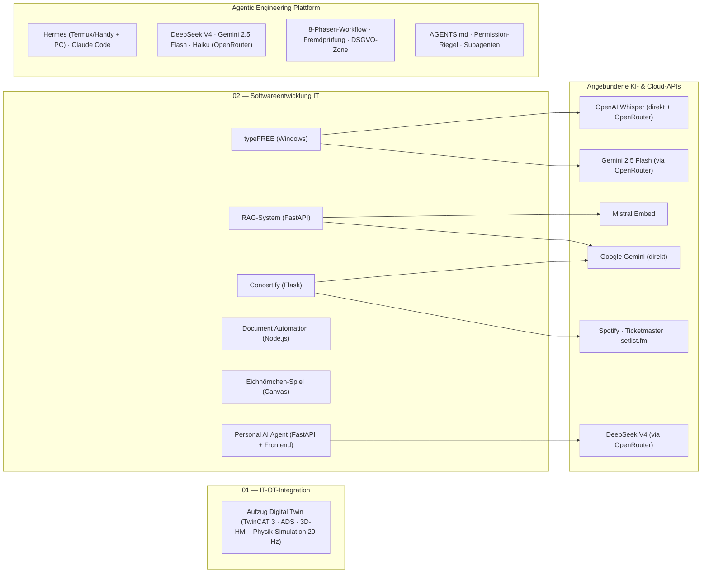

# Agentic Engineering — Portfolio: Software von der Web-Anwendung bis zur Maschinensteuerung

> **English summary:** Engineering portfolio of a software developer with an automation background (B.Sc. Electrical & Information Engineering). It covers two isolated domains: **IT** — web, voice-to-text, RAG and document-automation projects built with Python and Node.js — and **OT** — a TwinCAT 3 elevator control coupled with a Node.js ADS bridge and a Three.js 3D HMI as a hardware-in-the-loop simulation. All projects follow a disciplined, phase-based agentic-engineering workflow, documented at the end of this page.

Alle Projekte hier sind mit KI-Coding-Agenten entstanden — nach festem Regelwerk, nicht ad hoc.
Das Regelwerk dahinter ([AGENTS.md](AGENTS.md)) habe ich aus etablierten Praktiken
zusammengestellt und über mehrere Projekte an meine Arbeit angepasst; entstanden ist es neben
der Arbeit in der Automatisierungstechnik, heute wende ich es vor allem auf Anwendungssoftware an. Das Repository bündelt zwei getrennte Domänen:

* **[02_Softwareentwicklung_IT](02_Softwareentwicklung_IT/README.md):** Eigenständige Software-Projekte: Web-Anwendung (Flask), systemweites Diktier-Tool (Windows), semantische Wissensdatenbank (RAG), deklarative Dokumentengenerierung und ein persönlicher KI-Assistent (Android/Termux) mit automatischer Bearbeitung von Programmieraufträgen.
* **[01_IT-OT_Integration](01_IT-OT_Integration/README.md):** Kopplung einer industriellen SPS-Steuerung (TwinCAT 3, Structured Text) mit einer browserbasierten 3D-Visualisierung über eine Node.js-ADS-Brücke — als Hardware-in-the-Loop-Simulation ohne physische Anlage.

Beide Domänen laufen vollständig isoliert und tauschen keine Daten aus.

---

## Projektübersicht

| Projekt | Stack | Status | Doku |
|---|---|---|---|
| **Aufzug Digital Twin** | TwinCAT 3 (Structured Text), Node.js, `ads-client`, WebSockets, Three.js | Funktionaler Prototyp (HIL-Simulation) | [README](01_IT-OT_Integration/TwinCAT%20Projekts/README.md) |
| **Concertify** (Konzert-Playlists) | Python, Flask, SQLite, Server-Sent Events, Spotify-/Ticketmaster-API | Funktionaler Prototyp (lokaler Einsatz) | [README](02_Softwareentwicklung_IT/concertify/README.md) |
| **typeFREE** (Diktier-Tool) | Python, OpenAI Whisper (`whisper-1`, direkt + OpenRouter-Fallback), OpenRouter/Gemini 2.5 Flash (Textglättung), Keyboard-Hooks, pytest | Produktiv im Eigeneinsatz (Windows); 84 automatisierte Prüfungen; mitlaufende Kostenrechnung | [README](02_Softwareentwicklung_IT/typeFREE/README.md) |
| **RAG-System** (Wissensdatenbank) | Python, FastAPI, PostgreSQL/`pgvector`, Mistral `mistral-embed` (1024-D), Hybrid-Suche (RRF) | Funktionaler Prototyp | [README](02_Softwareentwicklung_IT/RAG-Systeme/README.md) |
| **Document Automation** | Node.js, `docx` (OpenXML), Puppeteer, `pdf-lib` | Stabil (lokales Tool) | [README](02_Softwareentwicklung_IT/document_automation/README.md) |
| **Eichhörnchen-Spiel** | HTML5 Canvas, Vanilla JS (eine Datei) | Abgeschlossen (Rapid-Prototyping-Demo) | [README](02_Softwareentwicklung_IT/eichhoernchen_spiel/README.md) |
| **Personal AI Agent** | Python, FastAPI, ChromaDB (Vektor-Gedächtnis), OpenRouter/DeepSeek, Frontend (Browser-Tab), Hermes-CLI-Agent | Produktiv im Eigeneinsatz (Android/Termux) | [README](02_Softwareentwicklung_IT/personal_ai_agent/README.md) |

**Bewusst nicht versioniert:** Zwei mobile Prototypen (Concertify Android, typeFREE Android) wurden nach technischer Evaluierung eingestellt und sind nicht Teil des Repositories — u. a. weil API-Schlüssel in einer verteilten APK per Dekompilierung auslesbar wären. Die Pivot-Begründungen stehen im [Bereichs-README](02_Softwareentwicklung_IT/README.md).

### Portfolio-Landkarte



Detail-Diagramme (Datenflüsse, APIs, Schichten) liegen in den jeweiligen Projekt-READMEs.  
Das Data-Flow-Diagramm der IT-Projekte (02) findet sich im [zugehörigen Bereichs-README](02_Softwareentwicklung_IT/README.md#architektur--datenflüsse).

---

## Verzeichnisstruktur

```
├── .claude/
│   ├── settings.json                    # Durchgesetzte Permission-Regeln (deny/ask/allow)
│   ├── skills/                          # Ausführbare Agenten-Verfahren
│   │   ├── phase/                       #   8-Phasen-Workflow, nur auf Abruf (/phase)
│   │   ├── grill-me/                    #   Alignment-Interview (Phase 2)
│   │   ├── grillAnAgent/                #   Brainstorm-Grill (Phase 1)
│   │   ├── fehlersuche/                 #   Ursache vor Reparatur, greift von selbst
│   │   └── critic/                      #   Fremdprüfung durch zweites Modell (pruefe.mjs)
│   └── agents/                          # Subagenten mit eigenem Kontextfenster
│       ├── rechercheur.md               #   Codesuche, gibt nur Fundstellen zurück
│       └── tester.md                    #   Prüfläufe, gibt nur Exit-Code und Fehlerzeilen zurück
├── 01_IT-OT_Integration/
│   └── TwinCAT Projekts/
│       ├── README.md
│       └── Elevator_TC/                # TwinCAT-3-Projekt
│           ├── Elevator_TC/            #   SPS-Code: FB_Elevator, FB_Door, E_ElevatorState …
│           ├── ads_bridge/             #   Node.js ADS-WebSocket-Brücke (server.js)
│           └── elevator_3d_demo.html   #   Three.js 3D-HMI
├── 02_Softwareentwicklung_IT/
│   ├── README.md
│   ├── concertify/                     # Flask-App: routes/ services/ domain/ repositories/ + tests/
│   ├── typeFREE/                       # Windows-Diktier-Client + Installer (typefree.py, installer/)
│   ├── RAG-Systeme/                    # ingest.py · query_db.py · main.py (FastAPI) · static/
│   ├── document_automation/            # build_cv.js · build_pdf.js · merge_pdfs.js
│   └── eichhoernchen_spiel/            # index.html (Canvas-Demo)
│   └── personal_ai_agent/              # FastAPI-Assistent + Frontend (backend/, frontend/, docs/)
├── AGENTS.md                           # Die eine Quelle der Kernregeln (werkzeugübergreifend)
├── CLAUDE.md                           # Nur das Claude-Code-Spezifische + Import von AGENTS.md
├── sync-rules.ps1                      # Erzeugt die Bereichs-CLAUDE.md aus CLAUDE_EXTENDS.md
└── README.md
```

---

## Architektur-Entscheidungen

**1. TwinCAT: Hardware-in-the-Loop statt Physik in der SPS.** SPS-Laufzeiten haben keine native Physik. Statt die Steuerungslogik mit künstlichen Verzögerungen zu verfälschen, simuliert die Node.js-Brücke das mechanische Verhalten (Kabinenhöhe, Türen) im 50-ms-Zyklus und liefert simulierte Sensorwerte an die reale SPS-Logik zurück. Die Schrittkette nutzt ein typsicheres Enum (`eStep : E_ElevatorState`); Not-Halt und Brandfall haben auf SPS-Ebene Vorrang und sind vom HMI nicht übersteuerbar. → [Details](01_IT-OT_Integration/TwinCAT%20Projekts/README.md)

**2. Concertify: Pivot von Mobile zu lokalem Web-Server.** Die setlist.fm-API limitiert global auf ~2 Anfragen/Sekunde pro IP. Eine Multi-User-Mobile-App hätte dieses Kontingent sofort erschöpft; der Wechsel zu einem lokalen Single-User-Flask-Server löst den IP-Konflikt ohne Serverkosten. Lange Sync-Läufe werden über Server-Sent Events mit Live-Fortschritt und atomare JSON-Snapshots abgefedert. → [Details](02_Softwareentwicklung_IT/concertify/README.md)

**3. RAG-System: Ablösung von n8n durch eine Python-Pipeline.** Der erste Entwurf als visueller n8n-Cloud-Workflow ließ sich schlecht versionieren und nicht automatisiert testen. Die Migration zu Skripten ([ingest.py](02_Softwareentwicklung_IT/RAG-Systeme/ingest.py), [query_db.py](02_Softwareentwicklung_IT/RAG-Systeme/query_db.py)) macht die Kernlogik — absatz- und satzgrenzenbasiertes Chunking, Hybrid-Suche aus `pgvector`-Vektorsuche und BM25 via Reciprocal Rank Fusion — als testbaren, diffbaren Code sichtbar. → [Details](02_Softwareentwicklung_IT/RAG-Systeme/README.md)

**4. typeFREE: Clipboard-Injektion statt Tastatur-Simulation.** Diktate werden im RAM aufgezeichnet, per Whisper transkribiert, durch OpenRouter/Gemini 2.5 Flash von Füllwörtern befreit und über die Zwischenablage (`Strg+V`) in das aktive Fenster injiziert. Das Einfügen als ein Block statt zeichenweiser Tastensimulation vermeidet Umlaut-Codierungsfehler und Timing-Probleme. → [Details](02_Softwareentwicklung_IT/typeFREE/README.md)

**5. Document Automation: deklarative Dokumente statt manueller Formatierung.** Lebensläufe und Anschreiben werden aus strukturierten Daten per Code generiert (OpenXML/`docx`, Puppeteer-PDF-Rendering). Inhaltsänderungen können das Layout nicht mehr zerschießen; die Engine ist strikt von den privaten Bewerbungsdaten getrennt, die nie ins Repository gelangen. → [Details](02_Softwareentwicklung_IT/document_automation/README.md)

---

## Agentic Engineering als Methode

Alle Projekte sind mit KI-Coding-Agenten entstanden — nicht ad hoc, sondern
entlang eines festen Regelwerks, das selbst Teil des Repositories ist. Der Kern:

- **Acht Phasen pro Feature:** Brainstorm → Alignment → Planung → Implementierung
  → Testing → Recap → Refactor → Commit — aufgerufen über den `/phase`-Skill.
- **Eine Regelquelle:** `AGENTS.md` ist die werkzeugneutrale Quelle; das Werkzeug
  heute ist **Hermes** (Termux/Handy + PC) und bei Bedarf Claude Code.
- **Fertig heißt verifiziert:** Ein Schritt ist erst fertig, wenn der Prüfbefehl
  des Projekts Exit-Code 0 liefert ([Tabelle →](docs/agentic-engineering-methode.md#das-verifier-gate-woran-fertig-hängt)).
- **Fremdprüfung durch zweites Modell:** In Planung/Testing/Refactor prüft ein
  anderes Modell (Critic, DSGVO-konform über OpenRouter), in der Implementierung
  ausdrücklich nicht.

Die ausführliche Fassung — die komplette Reise ("Von Claude Code zum
Multi-Modell-System"), die Begründung des Regelumbaus, die Messung der
Kontextkosten, die Detail-Ausführungen der Skills, Subagenten und der
Qualitäts-Gates — steht in **[docs/agentic-engineering-methode.md](docs/agentic-engineering-methode.md)**.

---

## Security & Privacy by Design

* **Secrets-Kapselung:** API-Schlüssel liegen ausschließlich in `.env`-Dateien, die per `.gitignore` ausgeschlossen sind. Eine [.env.example](02_Softwareentwicklung_IT/concertify/.env.example) dokumentiert die erwarteten Variablen, ohne Werte offenzulegen.
* **Keine Keys in verteilten Clients:** Die mobilen Prototypen wurden u. a. deshalb nicht versioniert, weil clientseitig eingebettete API-Schlüssel per Dekompilierung extrahierbar wären; für OAuth kam dort der PKCE-Flow zum Einsatz, der ohne `Client Secret` auf dem Endgerät auskommt.
* **Lokale Verarbeitung sensibler Daten:** Die Dokumentengenerierung läuft vollständig lokal; private Bewerbungsdaten sind vom versionierten Code getrennt und nicht Teil des Repositories.
* **Transparente Cloud-Grenzen:** Wo externe LLM-APIs genutzt werden (Whisper, Mistral, Gemini), ist das in den Projekt-READMEs ausgewiesen — inklusive der Datenflüsse.

---

## Schnellstart

### Concertify (Flask-Webapp)
```bash
cd 02_Softwareentwicklung_IT/concertify
pip install -r requirements.txt
python app.py
# → http://localhost:5000
```

### typeFREE (Windows-Diktier-Client)
```bash
cd 02_Softwareentwicklung_IT/typeFREE/windows
pip install -r requirements.txt
python typefree.py
# Läuft im Systemtray; Aufnahme per Alt + Ä (halten).
# Schlüssel stehen in einer .env neben dem Programm — nie im Code, nie in der EXE.
# Prüfungen: set PYTHONPATH=. && python -m pytest windows/tests -v
```

### RAG-System (Wissensdatenbank)
```bash
cd 02_Softwareentwicklung_IT/RAG-Systeme
pip install -r requirements.txt
python init_db.py      # Schema anlegen (PostgreSQL/pgvector, z. B. Supabase)
python ingest.py       # Dokumente einlesen und einbetten
python query_db.py     # CLI-Abfrage — alternativ: python main.py (FastAPI-Web-UI, Port 8000)
```

### Aufzug Digital Twin (TwinCAT + ADS-Brücke)
1. `01_IT-OT_Integration/TwinCAT Projekts/Elevator_TC/Elevator_TC.sln` in TwinCAT 3 öffnen, Konfiguration aktivieren, SPS in den Run-Modus versetzen.
2. Brücke starten:
   ```bash
   cd "01_IT-OT_Integration/TwinCAT Projekts/Elevator_TC/ads_bridge"
   npm install
   npm start
   ```
3. `elevator_3d_demo.html` im Browser öffnen.

### Eichhörnchen-Spiel
`02_Softwareentwicklung_IT/eichhoernchen_spiel/index.html` direkt im Browser öffnen — keine Abhängigkeiten.

### Personal AI Agent (persönlicher KI-Assistent, läuft auf diesem Handy/Termux)
```bash
cd 02_Softwareentwicklung_IT/personal_ai_agent/backend
pip install -r requirements.txt
cp .env.example .env      # → OPENROUTER_API_KEY eintragen
python -m uvicorn app.main:app --host 0.0.0.0 --port 8080 --reload
# Frontend: frontend/index.html im Browser öffnen; API-Docs: http://localhost:8080/docs
```
Start über das Android-Widget: `start-termux.sh` (holt updates + startet Server).
