# Agentic Engineering — Portfolio: Software von der Web-Anwendung bis zur Maschinensteuerung

> **English summary:** Engineering portfolio of a software developer with an automation background (B.Sc. Electrical & Information Engineering). It covers two isolated domains: **IT** — web, voice-to-text, RAG and document-automation projects built with Python and Node.js — and **OT** — a TwinCAT 3 elevator control coupled with a Node.js ADS bridge and a Three.js 3D HMI as a hardware-in-the-loop simulation. All projects follow a disciplined, phase-based agentic-engineering workflow, documented at the end of this page.

Alle Projekte hier sind mit KI-Coding-Agenten entstanden — nach festem Regelwerk, nicht ad hoc.
Das Regelwerk dahinter ([CLAUDE.md](CLAUDE.md)) habe ich aus etablierten Praktiken
zusammengestellt und über mehrere Projekte an meine Arbeit angepasst; entstanden ist es neben
der Arbeit in der Automatisierungstechnik, heute wende ich es vor allem auf Anwendungssoftware an. Das Repository bündelt zwei getrennte Domänen:

* **[02_Softwareentwicklung_IT](02_Softwareentwicklung_IT/README.md):** Eigenständige Software-Projekte: Web-Anwendung (Flask), systemweites Diktier-Tool (Windows), semantische Wissensdatenbank (RAG) und deklarative Dokumentengenerierung.
* **[01_IT-OT_Integration](01_IT-OT_Integration/README.md):** Kopplung einer industriellen SPS-Steuerung (TwinCAT 3, Structured Text) mit einer browserbasierten 3D-Visualisierung über eine Node.js-ADS-Brücke — als Hardware-in-the-Loop-Simulation ohne physische Anlage.

Beide Domänen laufen vollständig isoliert und tauschen keine Daten aus.

---

## Projektübersicht

| Projekt | Stack | Status | Doku |
|---|---|---|---|
| **Aufzug Digital Twin** | TwinCAT 3 (Structured Text), Node.js, `ads-client`, WebSockets, Three.js | Funktionaler Prototyp (HIL-Simulation) | [README](01_IT-OT_Integration/TwinCAT%20Projekts/README.md) |
| **Concertify** (Konzert-Playlists) | Python, Flask, SQLite, Server-Sent Events, Spotify-/Ticketmaster-API | Funktionaler Prototyp (lokaler Einsatz) | [README](02_Softwareentwicklung_IT/concertify/README.md) |
| **typeFREE** (Diktier-Tool) | Python, OpenAI Whisper (`whisper-1`, direkt + OpenRouter-Fallback), OpenRouter/Gemini 2.0 Flash (Textglättung), Keyboard-Hooks, pytest | Produktiv im Eigeneinsatz (Windows); 67 automatisierte Prüfungen; mitlaufende Kostenrechnung | [README](02_Softwareentwicklung_IT/typeFREE/README.md) |
| **RAG-System** (Wissensdatenbank) | Python, FastAPI, PostgreSQL/`pgvector`, Mistral `mistral-embed` (1024-D), Hybrid-Suche (RRF) | Funktionaler Prototyp | [README](02_Softwareentwicklung_IT/RAG-Systeme/README.md) |
| **Document Automation** | Node.js, `docx` (OpenXML), Puppeteer, `pdf-lib` | Stabil (lokales Tool) | [README](02_Softwareentwicklung_IT/document_automation/README.md) |
| **Eichhörnchen-Spiel** | HTML5 Canvas, Vanilla JS (eine Datei) | Abgeschlossen (Rapid-Prototyping-Demo) | [README](02_Softwareentwicklung_IT/eichhoernchen_spiel/README.md) |

**Bewusst nicht versioniert:** Zwei mobile Prototypen (Concertify Android, typeFREE Android) wurden nach technischer Evaluierung eingestellt und sind nicht Teil des Repositories — u. a. weil API-Schlüssel in einer verteilten APK per Dekompilierung auslesbar wären. Die Pivot-Begründungen stehen im [Bereichs-README](02_Softwareentwicklung_IT/README.md).

### Portfolio-Landkarte

```mermaid
graph LR
    subgraph OT["01 — IT-OT-Integration"]
        E["Aufzug Digital Twin (TwinCAT 3 · ADS · 3D-HMI · Physik-Simulation 20 Hz)"]
    end

    subgraph IT["02 — Softwareentwicklung IT"]
        C["Concertify (Flask)"]
        T["typeFREE (Windows)"]
        R["RAG-System (FastAPI)"]
        D["Document Automation (Node.js)"]
        S["Eichhörnchen-Spiel (Canvas)"]
    end

    subgraph APIs["Angebundene KI- & Cloud-APIs"]
        WH["OpenAI Whisper (direkt + OpenRouter)"]
        G2F["Gemini 2.0 Flash (via OpenRouter)"]
        MB["Mistral Embed"]
        G2["Google Gemini (direkt)"]
        SP["Spotify · Ticketmaster · setlist.fm"]
    end

    subgraph AE["Agentic Engineering Plattform"]
        CLI["VS Code + Cline · Claude Code · Antigravity"]
        MOD["DeepSeek V4 · Gemini 2.5 Flash · Haiku (OpenRouter)"]
        WF["8-Phasen-Workflow · Fremdprüfung · DSGVO-Zone"]
    end

    C["Concertify (Flask)"] --> SP
    C --> G2
    T["typeFREE (Windows)"] --> WH
    T --> G2F
    R["RAG-System (FastAPI)"] --> G2
    R --> MB
```



Detail-Diagramme (Datenflüsse, APIs, Schichten) liegen in den jeweiligen Projekt-READMEs.  
Das Data-Flow-Diagramm der IT-Projekte (02) findet sich im [zugehörigen Bereichs-README](02_Softwareentwicklung_IT/README.md#architektur--datenflüsse).

---

## Verzeichnisstruktur

```
├── .claude/skills/                      # Ausführbare Agenten-Verfahren
│   ├── grill-me/                        #   Alignment-Interview (Phase 2)
│   └── critic/                          #   Fremdprüfung durch zweites Modell (pruefe.mjs)
├── 01_IT-OT_Integration/
│   └── TwinCAT Projekts/
│       ├── README.md
│       └── Elevator_TC/                # TwinCAT-3-Projekt
│           ├── Elevator_TC/            #   SPS-Code: FB_Elevator, FB_Door, E_ElevatorState …
│           ├── ads_bridge/             #   Node.js ADS-WebSocket-Brücke (server.js)
│           └── elevator_3d_demo.html   #   Three.js 3D-HMI
├── 02_Softwareentwicklung_IT/
│   ├── README.md
│   ├── concertify/                     # Flask-App: routes/ services/ domain/ repositories/ + tests/
│   ├── typeFREE/                       # Windows-Diktier-Client + Installer (typefree.py, installer/)
│   ├── RAG-Systeme/                    # ingest.py · query_db.py · main.py (FastAPI) · static/
│   ├── document_automation/            # build_cv.js · build_pdf.js · merge_pdfs.js
│   └── eichhoernchen_spiel/            # index.html (Canvas-Demo)
├── CLAUDE.md                           # Globales Agenten-Regelwerk (die eine Quelle)
├── AGENTS.md                           # Herstellerneutraler Wegweiser auf CLAUDE.md
├── sync-rules.ps1                      # Erzeugt die Bereichs-CLAUDE.md aus CLAUDE_EXTENDS.md
└── README.md
```

---

## Architektur-Entscheidungen

**1. TwinCAT: Hardware-in-the-Loop statt Physik in der SPS.** SPS-Laufzeiten haben keine native Physik. Statt die Steuerungslogik mit künstlichen Verzögerungen zu verfälschen, simuliert die Node.js-Brücke das mechanische Verhalten (Kabinenhöhe, Türen) im 50-ms-Zyklus und liefert simulierte Sensorwerte an die reale SPS-Logik zurück. Die Schrittkette nutzt ein typsicheres Enum (`eStep : E_ElevatorState`); Not-Halt und Brandfall haben auf SPS-Ebene Vorrang und sind vom HMI nicht übersteuerbar. → [Details](01_IT-OT_Integration/TwinCAT%20Projekts/README.md)

**2. Concertify: Pivot von Mobile zu lokalem Web-Server.** Die setlist.fm-API limitiert global auf ~2 Anfragen/Sekunde pro IP. Eine Multi-User-Mobile-App hätte dieses Kontingent sofort erschöpft; der Wechsel zu einem lokalen Single-User-Flask-Server löst den IP-Konflikt ohne Serverkosten. Lange Sync-Läufe werden über Server-Sent Events mit Live-Fortschritt und atomare JSON-Snapshots abgefedert. → [Details](02_Softwareentwicklung_IT/concertify/README.md)

**3. RAG-System: Ablösung von n8n durch eine Python-Pipeline.** Der erste Entwurf als visueller n8n-Cloud-Workflow ließ sich schlecht versionieren und nicht automatisiert testen. Die Migration zu Skripten ([ingest.py](02_Softwareentwicklung_IT/RAG-Systeme/ingest.py), [query_db.py](02_Softwareentwicklung_IT/RAG-Systeme/query_db.py)) macht die Kernlogik — absatz- und satzgrenzenbasiertes Chunking, Hybrid-Suche aus `pgvector`-Vektorsuche und BM25 via Reciprocal Rank Fusion — als testbaren, diffbaren Code sichtbar. → [Details](02_Softwareentwicklung_IT/RAG-Systeme/README.md)

**4. typeFREE: Clipboard-Injektion statt Tastatur-Simulation.** Diktate werden im RAM aufgezeichnet, per Whisper transkribiert, durch OpenRouter/Gemini 2.0 Flash von Füllwörtern befreit und über die Zwischenablage (`Strg+V`) in das aktive Fenster injiziert. Das Einfügen als ein Block statt zeichenweiser Tastensimulation vermeidet Umlaut-Codierungsfehler und Timing-Probleme. → [Details](02_Softwareentwicklung_IT/typeFREE/README.md)

**5. Document Automation: deklarative Dokumente statt manueller Formatierung.** Lebensläufe und Anschreiben werden aus strukturierten Daten per Code generiert (OpenXML/`docx`, Puppeteer-PDF-Rendering). Inhaltsänderungen können das Layout nicht mehr zerschießen; die Engine ist strikt von den privaten Bewerbungsdaten getrennt, die nie ins Repository gelangen. → [Details](02_Softwareentwicklung_IT/document_automation/README.md)

---

## Agentic Engineering als Methode

Alle Projekte sind mit KI-Coding-Agenten entstanden — nicht ad hoc, sondern entlang eines festen Regelwerks, das selbst Teil des Repositories ist.  
Dieser Abschnitt beschreibt nicht nur die Methode, sondern auch die **persönliche Reise**, die dahinter steht: 9 Monate Experimentieren mit Plattformen, Modellen und Kostenmodellen, deren Erkenntnisse in jeden Aspekt des Workflows eingeflossen sind.

### Meine Reise: Von Claude Code zum Multi-Modell-System

| Zeit | Setup | Warum? |
|---|---|---|
| **2025** | Erste Gehversuche: Chatbots personalisiert, System-Prompts mit Ingenieurs-Denkweise optimiert | Prä-Agenten-Ära — den Grundstein für strukturierte Prompt-Architektur gelegt |
| **Januar 2026** | Start mit **Claude Code** (Enterprise-Team-Lizenz, Sonnet, Opus) | Erster KI-Coding-Agent im professionellen Einsatz |
| **März–Mai 2026** | Berufliche Praxis: TwinCAT 3, VB.NET-HMI, IO-Listen-Generierung, Schaltplan-Vergleich | KI als "Experience-Partner" — schneller lernen, nicht langsamer; Vorreiter im Team gegen alte Denkweise |
| **Juni–Juli 2026** | **Antigravity** + Google One (2× 12 €) — Test günstigerer Alternative | Kosten sparen, aber unzufrieden mit Ergebnissen |
| **August 2026** | **VS Code + Cline** (Agent-Harness) + **OpenRouter** + Multi-Modell | Claude Code-Limits verschärft; DSGVO-konforme, kosteneffiziente Alternative gefunden |

**Das heutige Setup:** Nicht *ein* Tool, sondern ein orchestriertes System aus Plattformen und Modellen:

| Aufgabe | Werkzeug | Modell |
|---|---|---|
| Planung & Implementierung | VS Code + Cline | **DeepSeek V4** (kostengünstig) |
| Bildverarbeitung | VS Code + Cline (Modell-Wechsel) | **Gemini 2.5 Flash** (beste Bild-Interpretation) |
| Fremdprüfung (Critic) | OpenRouter (API-Gateway) | **Anthropic Haiku** (DSGVO-konform, andere Modellfamilie) |
| Alternativ-Plattformen | Claude Code / Antigravity | Je nach Verfügbarkeit & Kontingent |

> **Die Kern-Erkenntnis:** Nicht das Tool entscheidet über Qualität, sondern das **System aus orchestrierten Modellen**, das je nach Aufgabe, Kosten und Compliance das passende Modell wählt.

### Phasenbasierter Entwicklungszyklus

Jedes Feature durchläuft acht Phasen: **Brainstorm → Alignment → Planung → Implementierung → Testing → Recap → Refactor → Commit**. Gearbeitet wird in kleinen vertikalen Slices mit atomaren Commits; nach jeder Phase wird der Agenten-Kontext geleert, weil Modelle bei wenig und präzisem Kontext am zuverlässigsten arbeiten. Drei Regeln stechen heraus:

* Im *Alignment* werden alle architektonischen Verzweigungen per Interview geklärt, bevor Code entsteht — der Agent trifft keine Gestaltungsentscheidung selbst.
* *Testing*, *Recap* und *Refactor* dürfen nie übersprungen werden.
* In den Phasen *Planung*, *Testing* und *Refactor* prüft ein **fremdes Modell** gegen (siehe unten). In der *Implementierung* ist das ausdrücklich untersagt: Kritik während des Bauens zerfasert die Umsetzung.

### Ein Regelwerk, drei Einstiege

Damit die Regeln nicht an mehreren Stellen auseinanderlaufen, gibt es genau **eine** Quelle:

| Datei | Rolle |
|---|---|
| [CLAUDE.md](CLAUDE.md) | Die Quelle: Leitplanken, Arbeitsweise, 8-Phasen-Workflow |
| [AGENTS.md](AGENTS.md) | Herstellerneutraler Wegweiser für Agenten, die diese Konvention lesen (Codex, Antigravity, Cursor) — er verweist, er kopiert nicht |
| `CLAUDE_EXTENDS.md` je Bereich | Nur die Zusatzregeln der Domäne: SPS-Namenskonventionen (Ungarische Präfixe, Zehner-Schrittketten) in OT, Design- und SEO-Vorgaben in IT |

[sync-rules.ps1](sync-rules.ps1) erzeugt daraus die Bereichs-`CLAUDE.md`: ein Verweis auf die Wurzel-Datei plus die lokale Erweiterung.

**Der Umbau dahinter:** Ursprünglich kopierte das Skript das komplette Basis-Regelwerk in jede Bereichsdatei. Das erzeugte zwei Probleme — die Kopien konnten unbemerkt von der Quelle abdriften, und jeder Agent lud dieselben ~130 Zeilen ein zweites Mal in seinen Kontext. Heute steht dort ein zweizeiliger Verweis; die Basisregeln liest der Agent ohnehin von der Wurzel aus mit.

### Zwei ausführbare Skills statt Prosa-Regeln

Die zwei heikelsten Stellen im Zyklus sind nicht als Merksatz formuliert, sondern als Verfahren mit festem Ablauf, Abbruchkriterium und einer Tabelle typischer Ausreden samt Gegenrede.

**[`grill-me`](.claude/skills/grill-me/SKILL.md) — der Grill *vor* dem Bauen.** Alignment als ausführbares Verfahren: erst ein Register aus 8–15 Annahmen zum Widersprechen, dann sokratische Einzelfragen — eine pro Nachricht, immer mit 2–4 konkreten Optionen und einer begründeten Empfehlung, sodass eine Antwort aus einem Buchstaben bestehen kann. Danach drei Angriffe auf das eigene Ergebnis (*„Das scheitert, wenn …"*), erst dann die `alignment.md`. Die eiserne Regel: keine Datei-Änderung am Zielprojekt, bevor das Alignment freigegeben ist. Zeichnen sich mehr als ~15 Fragen ab, gilt nicht die Fragenzahl als Problem, sondern der Slice — dann wird geteilt.

**[`critic`](.claude/skills/critic/SKILL.md) — der Grill *nach* dem Bauen.** Generator-Critic-Muster über zwei Modellfamilien: ein Modell baut, ein Modell einer anderen Familie prüft, weil beide unterschiedliche blinde Flecken haben. Zwei Konstruktionsprinzipien: Das fremde Modell bekommt den Code im Prompt übergeben — es liest keine Dateien und führt nichts aus. Und es liefert **Befunde, keine Urteile**: entschieden wird je Punkt vom Menschen, nie automatisch behoben. Einstiegspunkt ist [`pruefe.mjs`](.claude/skills/critic/pruefe.mjs), das Prompt, Format und Fehlerbehandlung mitbringt:

| Motor | Aufruf | Kontingent | Einschränkung |
|---|---|---|---|
| **Haiku via OpenRouter** (DSGVO-Standard) | `--openrouter` oder Flag-frei | API-Kosten | DSGVO-konform, Daten nicht zur Produktverbesserung; API-Key per Header |
| Gemini-API (Fallback) | `--gemini` | 1.500 Läufe/Tag | API-Schlüssel nötig, per Header übertragen — nie in der URL |
| Antigravity | `--agy` | 20 Läufe/Tag | kein Schlüssel nötig, max. 30.000 Zeichen |
| Codex (Sonderfall) | explizit | Monatskontingent | schärfer bei Nebenläufigkeit, nur auf ausdrücklichen Wunsch |

### Was die Fremdprüfung messbar gelehrt hat

1. **Großer Prüfumfang kostet Befunde.** Gleicher Code, gleiches Modell: Bei 27.000 Tokens meldete der Critic einen schweren Befund (Feldzugriff auf ein möglicherweise nicht gesetztes Objekt). Im Wiederholungslauf mit 62.000 Tokens fehlte genau dieser Befund. Konsequenz: lieber drei gezielte Läufe über einzelne Dateien als einer über alles — das Kontingent ist reichlich, die Aufmerksamkeit des Modells ist der Engpass.
2. **Schweregrade sind unzuverlässig.** Dieselbe SQL-Injection kam je nach Modell als *kritisch* oder *hoch* zurück, ein sicherer Absturz als *mittel*. Jeder Befund wird deshalb nachgestuft und die Korrektur kenntlich gemacht, statt das Protokoll durchzureichen.
3. **Ein leeres Protokoll ist keine Freigabe.** Die Fremdprüfung findet andere Dinge als ein Testlauf, nicht dieselben — sie ersetzt die Testphase nicht.
4. **Fehlerausgaben nie unterdrücken.** Wird `stderr` verworfen, ist ein Kontingent- oder Authentifizierungsfehler nicht mehr von einem leeren Ergebnis zu unterscheiden. Genau daran ist der erste Aufbau mehrfach gescheitert.

### DSGVO-konforme Zone: OpenRouter als API-Gateway

Ein zentrales Merkmal der aktuellen Architektur: **OpenRouter dient als DSGVO-konformes API-Gateway**, das die Nutzung von Modellen (z. B. Anthropic Haiku für die Fremdprüfung) ermöglicht, ohne dass Daten zur Produktverbesserung verwendet werden dürfen.

| Aspekt | Umsetzung |
|---|---|
| Datenverarbeitung | OpenRouter verarbeitet Anfragen DSGVO-konform; keine Nutzung der Inhalte für Modell-Training |
| API-Key-Handling | Schlüssel per Header (nie in der URL), zusätzlich abgesichert durch `.env` und `.gitignore` |
| Kostenkontrolle | Pay-per-Use statt Abo — günstiger als Flatrate-Modelle bei geringem Volumen |
| Zukunfts-Roadmap | Concertify soll von direkter Gemini-API auf OpenRouter umgestellt werden |

### Grenze der Fremdprüfung: was das Repository nicht verlässt

Im kostenlosen Tier nutzt der Anbieter übermittelte Inhalte zur Produktverbesserung. Deshalb geht ausschließlich Code aus [02_Softwareentwicklung_IT](02_Softwareentwicklung_IT/README.md) an ein fremdes Modell. **SPS- und OT-Code aus [01_IT-OT_Integration](01_IT-OT_Integration/README.md), Kundendaten und alles unter NDA sind ausgenommen** — festgehalten als Bereichsdirektive in [CLAUDE.md](CLAUDE.md), nicht als guter Vorsatz.  
Selbst mit OpenRouter bleibt diese Grenze bestehen — DSGVO-konform heißt nicht automatisch "darf das Repository verlassen".

### Qualitäts-Gates: Architekt & Wächter

Jede größere Änderung durchläuft zwei komplementäre Rollen: Der **Architekt** entwirft (strikte Schichtung `routes → services → domain → repositories`, Dependency Injection über Konstruktoren), der **Wächter** prüft anschließend gegen einen festen Katalog:

| Check | Kriterium |
|---|---|
| Kapselung | Keine Schicht greift an einer anderen vorbei |
| Dependency Injection | Abhängigkeiten über Konstruktor/Abstraktionen, keine versteckten Globals |
| Testbarkeit | Kernlogik testbar ohne echte I/O |
| Komplexität | Methoden kompakt halten, Early Returns statt Verschachtelung |
| Frontend | Event-Delegation statt Inline-Handler |

Angewendet und dokumentiert ist das System im Concertify-Projekt: [dual_engineering_system.md](02_Softwareentwicklung_IT/concertify/docs/dual_engineering_system.md). Sichtbares Ergebnis ist die Testsuite unter [concertify/tests/](02_Softwareentwicklung_IT/concertify/tests/) (Unit-Tests je Schicht: `domain/`, `repositories/`, `services/`).

---

## Security & Privacy by Design

* **Secrets-Kapselung:** API-Schlüssel liegen ausschließlich in `.env`-Dateien, die per `.gitignore` ausgeschlossen sind. Eine [.env.example](02_Softwareentwicklung_IT/concertify/.env.example) dokumentiert die erwarteten Variablen, ohne Werte offenzulegen.
* **Keine Keys in verteilten Clients:** Die mobilen Prototypen wurden u. a. deshalb nicht versioniert, weil clientseitig eingebettete API-Schlüssel per Dekompilierung extrahierbar wären; für OAuth kam dort der PKCE-Flow zum Einsatz, der ohne `Client Secret` auf dem Endgerät auskommt.
* **Lokale Verarbeitung sensibler Daten:** Die Dokumentengenerierung läuft vollständig lokal; private Bewerbungsdaten sind vom versionierten Code getrennt und nicht Teil des Repositories.
* **Transparente Cloud-Grenzen:** Wo externe LLM-APIs genutzt werden (Whisper, Mistral, Gemini), ist das in den Projekt-READMEs ausgewiesen — inklusive der Datenflüsse.

---

## Schnellstart

### Concertify (Flask-Webapp)
```bash
cd 02_Softwareentwicklung_IT/concertify
pip install -r requirements.txt
python app.py
# → http://localhost:5000
```

### typeFREE (Windows-Diktier-Client)
```bash
cd 02_Softwareentwicklung_IT/typeFREE/windows
pip install -r requirements.txt
python typefree.py
# Läuft im Systemtray; Aufnahme per Alt + Ä (halten).
# Schlüssel stehen in einer .env neben dem Programm — nie im Code, nie in der EXE.
# Prüfungen: set PYTHONPATH=. && python -m pytest windows/tests -v
```

### RAG-System (Wissensdatenbank)
```bash
cd 02_Softwareentwicklung_IT/RAG-Systeme
pip install -r requirements.txt
python init_db.py      # Schema anlegen (PostgreSQL/pgvector, z. B. Supabase)
python ingest.py       # Dokumente einlesen und einbetten
python query_db.py     # CLI-Abfrage — alternativ: python main.py (FastAPI-Web-UI, Port 8000)
```

### Aufzug Digital Twin (TwinCAT + ADS-Brücke)
1. `01_IT-OT_Integration/TwinCAT Projekts/Elevator_TC/Elevator_TC.sln` in TwinCAT 3 öffnen, Konfiguration aktivieren, SPS in den Run-Modus versetzen.
2. Brücke starten:
   ```bash
   cd "01_IT-OT_Integration/TwinCAT Projekts/Elevator_TC/ads_bridge"
   npm install
   npm start
   ```
3. `elevator_3d_demo.html` im Browser öffnen.

### Eichhörnchen-Spiel
`02_Softwareentwicklung_IT/eichhoernchen_spiel/index.html` direkt im Browser öffnen — keine Abhängigkeiten.
